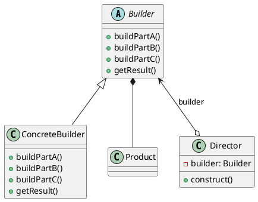

# 参考链接

* [设计模式 | 菜鸟教程](https://www.runoob.com/design-pattern/design-pattern-tutorial.html)

# 内容介绍

## 设计模式的重要性

软件工程中，设计模式是对软件设计中普遍存在的各种问题，所提出的解决方案。这个术语是由埃里希·伽玛（Erich Gamma）等人在1990年代从建筑设计领域引入到计算机科学的。

面向对象→功能模块（设计模式+算法+数据结构）→框架（使用到多种设计模式）→架构（服务器集群）

# 设计原则

## 设计模式的目的

设计模式的目的：

* 代码复用性（相同功能的代码，不用多次编写）
* 可读性（编程的规范性，便于其他程序员的阅读和理解）
* 可扩展性（当需要增加新功能时，非常的方便）
* 可靠性（当我们增加新的功能后，对原来的功能没有影响）
* 使程序呈现**高内聚，低耦合**的特性

设计模式的七大原则：

* 单一职责原则（Single responsibility principle）
* 接口隔离原则（Interface segregation principle）
* 依赖倒转原则（Dependence Inversion Principle）
* 里氏替换原则（Liskov Substitution Principle）
* 开闭原则（Open-Closed Principle）
* 迪米特法则（Law of Demeter）
* 合成复用原则（Composite Reuse Principle）

设计模式包含了面向对象的精髓，懂了设计模式，就懂了面向对象分析和设计的精要。

设计模式原则，即是设计模式为什么这样设计的依据。

## 单一职责原则（Single responsibility principle）

描述：

* 一个类应该只负责一项职责。

注意事项：

* 降低类的复杂度，一个类只负责一项职责。
* 提高类的可读性，可维护性。
* 降低变更引起的风险。
* 通常情况下，我们应当遵循单一职责原则。只有逻辑足够简单，才可以在代码级违反单一职责原则。
  只有类中方法数量足够少，可以在方法级别保持单一职责原则。

## 接口隔离原则（Interface segregation principle）

描述：

* 降低耦合度，接口单独设计，互相隔离。
* 客户端不应该依赖它不需要的接口，即一个类对另一个类的依赖应该建立在最小的接口上。

## 依赖倒转原则（Dependence Inversion Principle）

描述：

* 针对接口编程，实现开闭原则的基础。
* 高层模块不应该依赖低层模块，二者都应该依赖其抽象。
* 抽象不应该依赖细节，细节更应该依赖抽象。
* 依赖倒转的中心思想是面向接口编程。
* 依赖倒转原则基于这样的设计理念：
  相对于细节的多变性，抽象的东西要稳定的多。
  以抽象为基础搭建的架构比以细节为基础的结构要稳定的多。
  在java中，抽象指的是接口或抽象类，细节就是具体的实现类。
* 使用接口或抽象类的目的是制定好规范，而不涉及任何具体的操作，吧展现细节的任务交给它们的抽象类去完成。

依赖关系传递的三种方式：

* 接口传递
* 构造方法传递
* setter方式传递

注意事项：

* 低层模块尽量都要有抽象类或接口，或者两者都有，程序稳定性更好。
* 变量的声明类型尽量是抽象类或接口，这样我们的变量引用和实际对象间，就存在缓冲层，利于程序扩展和优化。
* 继承时遵循里氏替换原则。

## 里氏替换原则（Liskov Substitution Principle）

面向对象中继承性的思考和说明：

* 继承包含这样一层含义：父类中凡是已经实现好的方法，实际上是在设定规范和契约，
  虽然它不强制要求所有的子类必须遵循这些契约，但是如果子类对这些已经实现的方法任意修改，就会对整个继承体系造成破坏。
* 继承在给程序设计带来便利的同时，也带来了弊端。比如使用继承会给程序带来侵入性，程序的可移植性降低，增加对象间的耦合性。
  如果一个类被其他类继承，则当这个类需要修改时，必须考虑到所有的子类，
  并且父类修改后，所有涉及到子类的功能都有可能发生故障。

描述：

* 实现抽象的规范，实现子父类互相替换。
* 所有引用基类的地方必须能透明地使用其子类的对象。
* 在使用继承时，遵循里氏替换原则，子类尽量不要重写父类的方法。
* 里氏替换原则告诉我们，继承实际上让两个类的耦合性增加了。
  在适当的情况下，可以通过聚合，组合，依赖来解决问题，也可以让两个类继承自一个更普遍的基类。

## 开闭原则（Open-Closed Principle）

描述：

* 实现热插拔，提高扩展性。
* 开闭原则是编程中最基础、最重要的设计原则。
* 一个软件实体如类，模块和函数应该对扩展（提供方）开放，对修改（使用方）关闭。用抽象构建框架，用实现扩展细节。
* 当软件需要变化时，尽量通过扩展软件实体的行为来实现变化，而不是通过修改已有的代码来实现变化。
* 编程中遵循其他原则，以及使用设计模式的目的就是遵循开闭原则。

## 迪米特法则（Law of Demeter）

描述：

* 功能模块尽量独立。
* 一个对象应该对其他对象保持最少的了解。类与类的关系越密切，耦合度就越大。
* 迪米特法则又叫最少知道原则，即一个类对自己依赖的类知道的越少越好。
  也就是说，对于被依赖的类不管多复杂，都尽量将逻辑封装在类的内部。对外除了提供的公共方法，不对外泄露任何信息。
* 迪米特法则还有一个更简单的定义：只与直接的朋友通信。
* 直接的朋友：只要两个对象之间存在耦合，我们就说这两个对象是朋友关系。
  耦合的方式包括依赖、关联、组合、聚合等。
  出现在成员变量、方法参数、方法返回值中的类是直接的朋友，出现在局部变量中的类不是直接的朋友。

注意事项：

* 迪米特法则的核心是降低类之间的耦合。
* 由于每个类都减少了不必要的依赖，因此迪米特法则只是要求降低类或对象之间的耦合关系，并不是要求完全没有耦合关系。

## 合成复用法则（Composite Reuse Principle）

描述：

* 尽量使用合成、聚合的方式，而不是继承。

## 设计原则的核心思想

* 找出应用中可能需要变化之处，把它们独立出来，不需要和那些不需要变化的代码混在一起。
* 针对接口编程，而不是针对实现编程。
* 为了交互对象之间的松耦合设计而努力。

# UML类图

## 基本介绍

* UML（Unified modeling language 统一建模语言），是一种用于软件系统分析和设计的语言工具，它用于帮助软件开发人员进行思考和记录思路的结果。
* UML本是是一套符号的规定，就像数学符号和化学符号一样，这些符号用于描述软件模型中的各个元素和他们之间的关系，比如类、接口、实现、泛化、依赖、组合、聚合等。

六种关系：

* dependency：依赖关系。箭头格式为`-->`。
  * 一个类中使用到了另一个类。
* association：关联关系。箭头格式为`--`。
  * 类与类之间的联系。是依赖关系的特例。
  * 一个类的成员变量使用到了另一个类。
  * 关联具有导航性：即单向关系或双向关系。
  * 关联具有多重性：如一对一，一对多。
* generalization：泛化（继承）关系。箭头格式为`--|>`。
  * 一个类继承自另一个类。
* realization：实现关系。箭头格式为`..|>`。
  * 一个类实现了另一个接口。
* aggregation：聚合关系。箭头格式为`--o`。
  * 整体与部分的关系，整体和部分可以分开。是关联关系的特例。
  * 一个类的成员变量使用到了另一个类，并且通过setter方法或构造方法赋值。
  * 需要考虑到级联关系。
* composite：组合关系。箭头格式为`--*`。
  * 整体和部分的关系，整体和部分不能分开。是关联关系的特例。
  * 一个类的成员变量使用到了另一个类，并且通过直接实例化赋值。
  * 需要考虑到级联关系。

## UML图的类型

* 用例图
* 静态结构图：类图（核心）、对象图、包图、组件图、部署图
* 动态行为图：交互图（时序图与协作图）、状态图、活动图

# 设计模式

## 设计模式介绍

设计模式是程序员在面对同类软件工程设计问题所总结出来的有用的经验，模式不是代码，而是某类问题的通用解决方案。设计模式代表了最佳的实践。这些解决方案是众多软件开发人员经过相当长的一段时间的试验和错误总结出来的。

23种设计模式：

* 创造型模式：单例模式、简单工厂模式、工厂方法模式、抽象工厂模式、原型模式、建造者模式
* 结构型模式：适配器模式、桥接模式、装饰模式、组合模式、外观模式、享元模式、代理模式
* 行为型模式：模版方法模式、命令模式、访问者模式、迭代器模式、观察者模式、中介者模式、备忘录模式、解释器模式、状态模式、策略模式、责任链模式

注意：不同的书籍上对分类和名称略有差别

## 单例模式

采取一定的方法，保证在整个软件系统中，对某个类只能存在一个对象实例，并且该类只提供一个取得其对象实例的方法。

单例模式的八种实现方式：

* 饿汉式（静态常量）
  * 优点：写法比较简单，在类装载时完成实例化，避免了线程同步问题。
  * 缺点：没有达到懒加载效果，可能造成内存的浪费。
  * 描述：这种方式基于classloader机制避免了多线程的同步问题，不过，由于在类加载时就实例化，在单例模式中大多数都是调用getInstance方法，但是导致类装载的原因有很多种，因此不能确定有其他的方式（或者其他的静态方法）导致类装载，这时候初始化实例就没有达到懒加载的效果。
  * 结论：可以使用，但是可能造成内存的浪费。
* 饿汉式（静态代码块）
  * 描述：这种方式和上述方式其实是一样的，只不过将类实例化过程放在了静态代码块中。也是在类装载的时候，就执行静态代码块中的代码，初始化类的实例。
  * 结论：可以使用，但是可能造成内存的浪费。
* 懒汉式（线程不安全）
  * 优点：起到了懒加载的效果，但是只能在单线程下使用。
  * 缺点：线程不安全。
  * 描述：如果是在多线程下，一个线程进入了`if(instance == null)`判断语句，还未来得及往下执行，另一个线程也通过了这个判断语句，这时就会产生多个实例。所以在多线程环境下不可使用这种方式。
  * 结论：不要使用。
* 饿汉式（线程安全，同步方法）
  * 优点：线程安全。
  * 缺点：效率太低。
  * 描述：每个线程在想获得类的实例的时候，执行`getInstance()`方法都要进行同步。而其实这个方法只执行一个实例化代码就够了，后面想获得该类实例时，直接返回即可。
  * 结论：不推荐使用。
* 饿汉式（线程安全，同步代码块）
  * 描述：这种方式本意是对上述方式的改进，因为上述方式的同步方法效率太低，改为同步产生实例化的代码块。但是这种方式并不能起到线程同步的作用。跟上述方式遇到的情形一致。
  * 结论：不能使用。
* 双重检查
  * `volatile`关键字：一种轻量级的同步方式，将更改立刻同步到所有线程。
  * 优点：线层安全，延迟加载，效率较高。
  * 描述：double-check概念是多线程开发中常用到的，如代码中所示，我们进行了两次判断，保证了线程安全。这样，实例化代码只用执行一次，后面再次访问时，直接返回实例化对象，避免了反复进行方法同步。
  * 结论：推荐使用。
* 静态内部类
  * 静态内部类：当外部类装载时，静态内部类不会立刻装载。
  * 优点：线程安全，利用静态内部类的特点实现延迟加载，效率高。
  * 描述：这种方式采用了类装载的机制来保证初始化实例时只有一个线程。类的静态属性只会在第一个加载类时初始化，所以在这里，JVM帮助我们保证了线程的安全性，在类进行初始化时，别的线程是无法进入的。
  * 结论：推荐使用。
* 枚举
  * 优点：线程安全，能够防止反序列化重新创建新的对象，不能通过反射调用私有构造方法。
  * 缺点：不能拥有父类。
  * 结论：推荐使用。

注意事项：

* 单例模式保证了系统内存中该类只存在一个对象，节省了系统资源，对于一些需要频繁创建销毁的对象，使用单例模式可以提高系统性能。
* 当想实例化一个单例类的时候，必须要记住使用相应的获取对象的方法，而不是使用new关键字。
* 单例模式的使用场景：需要频繁地进行创建和销毁的对象、创建对象时耗时过多或者耗费资源过多（即：重量级对象），而又经常用到的工具类对象、频繁访问数据库或文件的对象（如：数据源、会话工厂等）。

使用处：

* jdk中的`Runtime`类。

## 工厂模式

### 简单工厂模式

传统方式的优缺点：

* 优点：容易理解，简单易操作。
* 缺点：违反了OCP原则。当我们给类添加新的功能时，不得不修改代码。

改进思路：

* 将创建目标对象的方法封装到一个类中。
* 当需要创建新的种类的目标对象时，仅需修改该类即可。

描述：

* 简单工厂模式属于创建型模式，是工厂模式的一种。
* 简单工厂模式又称静态工厂模式，工厂方法可以是静态的。
* 简单工厂模式是由一个工厂对象决定创建出哪一种产品类的实例。
* 简单工厂模式是工厂模式家族中最简单实用的模式。
* 在软件开发中，当我们会用到大量的创建某种、某类或某批对象时，就会使用到工厂模式。

实现思路：

定义一个工厂类，在其中定义一个创建对象的方法，由工厂方法的参数决定要实例化的类。

### 工厂方法模式

实现思路：

定义一个抽象工厂类，在其中定义一个创建对象的抽象方法，由其子类决定要实例化的类，将对象的实例化推迟到子类。

### 抽象工厂模式

描述：

* 抽象工厂模式定义了一个接口或抽象类，用于创建相关或者有依赖关系的对象簇，而无需指明具体的类。
* 抽象工厂模式可以将简单工厂模式和工厂方法模式进行整合。
* 从设计层面上看，抽象工厂模式就是对简单工厂模式的改进（即：进一步的抽象）。
* 将工厂抽象成两层，抽象工厂和具体实现的工厂。
* 程序员可以根据创建对象类型的使用对应的工厂子类，这样将单个的简单工厂类变成了工厂簇，更利于代码的维护和扩展。

实现思路：

定义一个抽象工厂类，在其中定义一个创建对象的抽象方法，由其子类和工厂方法的参数决定要实例化的类，将对象的实例化推迟到子类。

### 小结

使用处：

* jdk中的`Calendar`类。

工厂模式的意义：

将实例化对象的代码提取出来，放到一个类中统一管理和维护，达到和主项目的依赖关系的解耦，从而提高项目的扩展性和维护性。

设计模式的依赖抽象原则：

* 创建对象实例时，不要直接new类，而是将这个new类的动作放在一个工厂方法中并返回。或者说，变量不要直接持有具体类的引用。
* 不要让类继承具体类，而是继承抽象类或者实现接口。
* 不要覆盖基类中已经实现的方法。

## 原型模式

传统的方式的优缺点：

* 优点是比较好理解，简单易操作。
* 在创建新的对象时，总是要重新获取原始对象的属性，如果要创建的对象比较复杂时，效率较低。
* 总是要重新初始化对象，而不是动态地获取对象运行时的状态，不够灵活。

思路：

* 使用Java的Object类的clone方法，并实现Cloneable接口。

基本介绍：

* 用原型实例指定创建对象的种类，并且通过拷贝这些原型，创建新的对象。
* 原型模式是一种创建型设计模式，允许一个对象再创建另外一个可定制的对象，无需知道如何创建的细节。
* 工作原理是通过将一个原型对象传给那个要发动创建的对象，这个要发动创建的对象通过请求原型对象拷贝它们自己来创建。

使用处：

* Spring中的Scope为prototype的Bean。doGetBean方法。

浅拷贝与深拷贝：

* 对于数据类型是基本数据类型的成员变量，浅拷贝会直接进行值传递，也就是将该属性值复制一份给新的对象。
* 对于数据类型是引用类型的成员变量，浅拷贝会进行引用传递，也就是只将该成员变量的引用复制一份给新的对象。在这种情况下，在一个对象中修改成员变量会影响到另一个对象的对应成员变量。
* 浅拷贝是使用默认的clone方法实现。

深拷贝基本介绍：

* 复制对象的所有基本数据类型的成员变量值。
* 为所有引用类型的成员变量申请存储空间，并复制每个引用类型成员变量所引用的对象，直到该对象可达的所有对象。也就是说，要对整个对象进行拷贝。

实现方式：

* 重写clone方法实现。
* 通过对象序列化实现（推荐使用）。

注意事项：

* 创建新的对象比较复杂时，可以利用原型模式简化对象创建过程，提高效率。
* 不用重新初始化对象，而是动态地获得对象运行时的状态。
* 如果原始对象发生变化（增加或者减少属性），其他克隆对象也会发生相应的变化，无需修改代码。
* 在实现深克隆时可能需要比较复杂的代码。
* 缺点：需要为每个类配备一个克隆方法，违背了OCP原则。

## 建造者模式

传统方式的优缺点：

* 优点是比较好理解，简单易操作。
* 设计的程序结构过于简单，没有设计缓冲层对象，程序的扩展和维护性不好。把产品和创建的过程封装在一起，增加了耦合性。
* 解决方案：将产品和产品建造的过程解耦。

基本介绍：

* 建造者模式又称生成器模式，是一种对象构建模式，它可以将复杂的建造过程抽象出来，使这个抽象过程的不同实现方法可以构造出不同表现的对象。
* 建造模式是一步一步创建一个复杂的对象。它允许用户只通过复杂对象的类型和内容就可以构建它们，而不知道内部的具体构造细节。

建造者模式的四个角色：

* Product 产品。
  * 一个具体的产品对象。
* Builder 抽象建造者。
  * 创建一个Product的各个部件的指定的抽象类/接口。
* ConcreteBuilder 具体建造者。
  * 实现接口，构建和装配各个部件。
* Director 指挥者。
  * 构建一个Builder，用于创建一个复杂的对象。用于隔离客户与对象的生产过程，并负责控制Product的生产过程。

使用处：

* JDK中的StringBuilder、StringBuffer类。
  * Appendable 抽象建造者。
  * AbstractStringBuilder 具体建造者（不能实例化）。
  * StringBuilder 指挥者，具体建造者。
* Spring的默认配置类中大量使用。

注意事项：

* 客户端不必知道产品内部组成的细节，将产品本身与产品的创建过程解耦，使得相同的创建过程可以创建不同的产品对象。
* 每个具体建造者都相对独立，而与其他的具体建造者无关。用户使用不同的具体建造者即可得到不同的产品对象。
* 可以更加精细地控制产品的创建过程。将复杂产品的创建步骤分解在不同的方法中，使得创建过程更加清晰，也更加方便使用程序来控制创建过程。
* 增加新的具体建造者无需修改原有类库的代码，指挥者类针对抽象建造者编程，系统扩展方便，符合OCP原则。
* 建造者模式创建的产品一般具有较多的共同点，其组成部分相似，如果产品之间的差异性很大，则不适合使用建造者模式因此其使用范围受到一定限制。
* 如果产品的内部变化复杂，可能会导致需要定义很多具体建造者来实现这种变化，导致系统变得庞大。因此在这种情况下，要考虑是否选择构造者模式。

抽象工厂模式 VS 建造者模式

* 抽象工厂模式实现对产品家族的创建，建造者模式则按照一定的蓝图建造产品。
* 抽象工厂模式只关心产品由什么工厂生产即可，建造者模式则关心构建的过程。

## 适配器模式

基本介绍：

* 适配器模式将某个类的接口转换成客户端期望的另一个接口便是，主要目的是兼容性，让原本因接口不匹配不能一起工作的两个类可以协同工作，其别名是包装器。
* 适配器模式属于结构型模式。
* 主要分为三类：类适配器模式，对象适配器模式，接口适配器模式。

工作原理：

* 将一个类的接口转换成另一种接口，让原本接口不兼容的类可以兼容。
* 从用户的角度看不到被适配者，是解耦的。
* 用户调用适配器转化出来的目标接口方法，适配器再调用被适配者的相关接口方法。
* 用户收到反馈结果，感觉只是和目标交互。
* 被适配者→适配器→目标

类适配器模式：

* Adapter类通过继承src类，实现dst类接口，完成src→dst的适配。
* 由于src类的方法在Adapter中会暴露出来，增加了使用成本。
* 由于继承src类，所有可以根据需求重写src类的方法，使得Adapter的灵活性增强了。

对象适配器模式：

* 基本思路和类适配器模式相同，只是将Adapter类作修改，不是继承而是持有src类的实例，以解决兼容性的问题。即：持有src类，实现dst类接口，完成src→dst的适配。
* 根据合成复用原则，在系统中尽量使用关联关系来替代继承关系。
* 对象适配器模式是其中最常用的一种。

接口适配器模式：

* 当不需要全部实现接口提供的方法时，可以先设计一个抽象类实现接口，并未该接口中每个方法提供一个默认实现，那么该抽象类的子类可有选择地覆盖父类的某些方法来实现需求。
* 适用于一个接口不想使用所有方法的情况。

使用处：

* SpringMvc中的HandlerAdapter。

注意事项：

* 三种命名方式：根据src是以怎样的形式得到Adapter来命名的。
* 类适配器：以类得到，在Adapter里，将src当作类，继承
* 对象适配器：以对象得到，在Adapter里，将src作为一个对象，持有。
* 接口适配器：以接口得到，在Adapter里，将src作为一个接口，实现。
* 适配器模式最大的作用还是将原本不兼容的接口融合在一起工作。
* 实际开发中，实现起来不拘泥于我们讲解的三种经典模式。

## 桥接模式

传统方式的优缺点：

* 扩展性问题（类爆炸）。
* 违反了单一职责原则，当我们增加手机样式时，要同时增加所有品牌的手机，这样增加了代码维护的成本。

基本介绍：

* 将实现与抽象放在两个不同的类层次中，使两个层次可以独立改变。
* 属于结构型设计模式。
* 基于类的最小设计原则，通过使用封装、居合和继承等方式让不同的类承担不同的职责。
* 它的主要特点是把抽象与行为实现分离开，从而可以保持各部分的独立性以及应对他们的功能扩展。

> 将多继承关系变为多组合/聚合关系，可以考虑将主要关系保留为继承关系。

使用处：

* JDBC的Driver接口。由DriverManager得到Connection，具体的实现由注册的Driver决定。

注意事项：

* 实现了抽象和实现部分的分离，从而极大地提高了系统的灵活性，让抽象部分和实现部分独立开来，有助于系统进行分层设计，从而产生更好的结构化系统。
* 对于系统的高层部分，只需要知道抽象部分和实现部分的接口就可以了，其他的部分由具体的业务来完成。
* 桥接模式代替多层继承方案，可以减少子类的个数，降低系统的管理和维护成本。
* 桥接模式的引入增加了系统的理解和设计难度，由于居合关系建立在抽象层，要求开发者针对抽象进行设计和编程。
* 桥接模式要求正确识别出系统中两个独立变化的维度，因此其使用范围有一定的局限性。

## 装饰器模式

> 目标抽象继承顶级抽象，装饰器抽象继承顶级抽象并聚合目标抽象。通过递归的方式实现功能。

使用处：
* Java的IO结构。

## 组合模式

基本介绍：
* 组合模式，又称部分整体模式，它创建了对象组的树形结构，将对象组合成树状结构，以表示整体与部分的层次关系。
* 组合模式依据树形结构来组合对象，用来表示部分以及整体层次。
* 属于结构型模式。
* 组合模式使得用户对单个对象和组合对象的访问具有一致性，即，组合能让客户以一致的方式处理个别对象以及组合对象。

解决的问题：  
当我们要处理的对象可以生成一颗树形结构，而我们要对树上的节点和叶子进行操作时，它能提供一致的方式，而不用考虑它是节点还是叶子。 

组合模式的角色：
* Component：组合中对象声明的接口。在适当的情况下，实现所有类共有的接口默认行为。用于访问和管理Component子部件，Component可以是抽象类或接口。
* Leaf：叶子节点。叶子节点没有子节点。
* Composite：非叶子节点。用于存储子部件。在Component接口中实现子部件的相关操作。

使用处：

* Java的集合类（包括HashMap）。
* Swing和JavaFX的组件结构。
* Android的View结构。

注意事项：
* 简化客户端操作。客户端只需要面对一致的对象而不用考虑整体部分或者叶子节点的问题。
* 具有较强的扩展性，当我们要更改组合对象时，我们只需要调整内部的层次关系，客户端不用再做出任何改动。
* 方便筹建处复杂的层次结构。客户端不用理会组合里面的组成细节，容易添加节点或者叶子，从而创造出复杂的树形结构。
* 需要遍历组织结构，或者处理的对象具有树形结构时，非常适合使用组合模式。
* 要求较高的抽象性。如果节点和叶子有很多差异性的话，比如很多方法和属性都不一样，不适合使用组合模式。

## 外观模式

基本介绍：

* 外观模式又叫过程模式。外观模式为子系统中的一组接口提供一个一致的界面，此模式定义了一个高层接口，这个接口使得这一子系统更加容易使用。
* 外观模式通过定义一个一致的接口，用以屏蔽内部子系统的细节，使得调用端只需跟这个接口发生调用，而无需关心这个子系统的内部细节。

外观模式的角色：
* 外观类：为调用端提供统一的调用接口。外观类知道哪些子系统负责处理请求，从而将调用端的请求代理给适当的子系统对象。
* 调用者：外观接口的调用者。
* 子系统的集合：指模块或者子系统，处理外观类指派的任务，是功能的实际提供者。

注意事项：
* 外观模式对外屏蔽了子系统的细节，因此外观模式降低了客户端对子系统使用的复杂性。
* 外观模式对客户端与子系统的耦合关系，让子系统内部的模块更易维护和扩展。
* 合理使用外观模式，可以帮助我们更好的划分访问层次。
* 当系统需要进行分层设计师，可以考虑使用外观模式。
* 在维护一个遗留的大型系统时，可能这个系统已经变得非常难以维护和扩展，此时可以考虑为新系统开发一个Facade类，来提供遗留系统的比较清晰简单的接口，让系系统与Facade类交互，提高复用性。
* 不能过多地或者不合理地使用外观模式。要以让系统有层次，利于维护为目的。

## 享元模式

基本介绍：
* 享元模式也叫蝇量模式，运用共享技术有效地支持大量细粒度的对象。
* 常用于系统低层开发，解决系统的性能问题。像数据库连接池，里面都是创建好的连接对象，在这些对象中有我们需要的则直接拿来用，避免重新创建。如果没有我们需要的，则创建一个。
* 享元模式能够解决重复对象的内存浪费问题。当系统中有大量相似对象，需要缓冲池时，不总是创建新对象，可以从缓冲池里拿。这样可以降低系统内存，同时提高效率。

内部状态和外部状态：
* 享元模式提出了两个要求：细粒度和共享对象。这里涉及到了内部状态和外部状态，即将对象的信息分为两个部分：内部状态和外部状态。
* 内部状态指对象共享出来的信息，存储在享元对象内部且不会随着环境的改变而改变。
* 外部状态指对象得以依赖的一个标记，是随环境改变而改变的，不可共享的状态。

注意事项：
* 系统中有大量对象，这些对象消耗大量内存，并且对象的状态大部分可以外部化时，我们就可以考虑使用享元模式。
* 用唯一标识码判断，如果在内存中有，则返回这个唯一标识码所标识的对象，用HashMap存储。
* 享元模式大大减少了对象的创建，降低了程序内存的占用，提高了效率。
* 享元模式提高了系统的复杂度，需要分离出内部状态和外部状态，而外部状态具有 固化特性，不应该随着内部状态的改变而改变，这是我哦恶魔女需要注意的地方。
* 使用享元模式时，注意划分内部状态和外部状态，并且需要一个工厂类加以控制。

使用处：
* String常量池
* Integer对象缓存（如果在-128~127之间，则适用缓存）
* 数据库连接池
* 对象缓冲池

## 代理模式

基本介绍：

* 为一个对象提供一个替身，以控制这个对象的访问，即通过代理对象访问目标对象。这样做的好处是，可以在目标对象实现的基础上，增强额外的功能操作，即扩展目标对象的功能。
* 被代理的对象可以是远程对象、创建开销大的对象或需要安全控制的对象。
* 代理模式有不同的形式，主要有三种：静态代理，动态代理（jdk代理，接口代理）和cglib代理（可以在内存中动态创建对象，而不需要实现接口，属于动态代理）。

静态代理：
* 静态代理在使用时，需要定义接口或父类，被代理对象与代理对象一起实现相同的接口，或是继承相同的父类。
* 代理对象和目标对象要实现相同的接口，然后通过调用相同的方法来调用目标对象的方法。
* 优点：在不修改目标对象的前提下，能通过代理对象对目标功能扩展。
* 缺点：因为代理对象需要与目标对象实现一样的接口，所以会有很多代理类，一旦接口增加方法，目标对象与代理对象都要维护。

动态代理：
* 代理对象不需要实现接口，但是目标对象需要实现接口，否则不能使用动态代理。
* 代理对象的生成，是利用jdk的api，动态地在内存中构建代理对象。
* 如何使用：调用并返回`java.lang.reflect.Proxy`类的`newProxyInstance`静态方法。

cglib代理：
* 静态代理和jdk代理都要求目标对象实现一个接口，但是有时候目标对象只是一个单独的对象，没有实现任何接口，这时候就可以使用目标对象的子类来实现代理，即cglib代理。
* cglib代理也叫子类代理，它是在内存中创建一个子类对象，从而实现对目标对象的功能扩展。有些书也将cglib代理归属到动态代理。
* cglib是一个强大的高性能的代码生成包，它可以在运行时扩展java类与实现java接口，广泛用于许多aop框架（如Spring AOP），实现方法拦截。
* 在aop编程中如何实现代理模式：
  * 目标对象需要实现接口，使用jdk代理。
  * 目标对象不需要实现接口，使用cglib代理。
* cglib包的底层是通过使用字节码处理器框架asm来转换字节码并生成新的类。
* 注意：被cglib代理的类不能为final，方法不能是final/static。
* 如何使用：实现`net.sf.cglib.proxy.MethodInterceptor`接口，实例化`net.sf.cglib.proxy.Enhancer`，设置父类/接口和回调（为该实现类），调用并返回它的`create`方法。

几种常见的代理模式介绍：
* 防火墙代理：内网通过代理穿透防火墙，实现对公网的访问。
* 缓存代理：比如，当请求图片文件等资源时，先到缓存代理中去，如果取不到资源，再到公网或者数据库中取，然后缓存。
* 远程代理：远程对象的本地代表，通过它可以把远程对象当成本地对象来调用。远程代理通过网络和真正的远程对象沟通信息。
* 同步代理：主要使用在多线程编程中，完成多线程间同步工作。

## 模版模式

## 命令模式

## 访问者模式

## 迭代器模式

## 观察者模式

## 中介者模式

## 备忘录模式

## 解释器模式

## 状态模式

## 策略模式

## 责任链模式

