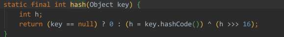

# HashMap

## HashMap简介

HashMap基于哈希表的Map接口实现，是以键值对存储的形式存在，即主要用来存储键值对。HashMap的实现不是同步的，这意味着它不是线程安全的。它的key、value都可以为null。此外，HashMap中的映射不是有序的。

JDK1.8之前的HashMap是由数组+链表组成的，数组是HashMap的主体，链表主要是为了解决hash冲突（两个对象调用的hashCode方法计算的哈希值一致导致计算的数组索引值相同）而存在的（拉链法解决冲突）。JDK1.8之后在解决哈希冲突时有了较大的变化。当链表长度大于等于阈值（默认为8），并且当前数组的长度大于64时，此时此索引位置上的所有数据改为使用红黑树存储。

补充：

将链表转换成红黑树前会判断，即使阈值大于8，但是数组长度小于64，此时并不会将链表变为红黑树，而是选择进行数组扩容。

这样做的目的是因为数组比较小，尽量避开红黑树结构，这种情况下变为红黑树结构，反而会降低效率效率。因为红黑树需要进行左旋、右旋、变色这些操作来保持平衡。同时数组长度小于64时，搜索时间相对要快些。所以综上所述为了提高性能和减少搜索时间，低层在阈值大于等于8并且数组长度大于等于64时，链表才转换成红黑树。

当然虽然增加了红黑树作为低层数据结构，结构变得复杂了，这种情况下效率也变得更加高效。

小结：
* 存取是无无序的
* 键的位置是唯一的，由低层的数据结构控制键
* JDK1.8之前的数据结构是链表+数组，JDK1.8之后数据结构是链表+数组+红黑树
* 当阈值>=8并且数组长度>=64，才将链表转换为红黑树，变为红黑树的目的是为了高效的查询。

## HashMap底层的数据结构

### 数据结构的概念

数据结构是计算机存储、组织数据的方式。数据结构是指相互之间存在一种或多种特定关系的数据元素的集合。通常情况下，精心选择的数据结构可以带来更高的运行或者存储效率。数据结构往往同高效的检索算法和索引技术有关。

### HashMap底层的数据结构存储数据的过程


* 当创建HashMap对象时，在JDK8之前，在构造方法中创建一个长度是16的`Entry[] table`，用于存储键值对数据。在JDK8之后，变为在第一次调用put方法时创建一个长度是16的`Entry[] table`。
* 假设向哈希表中存储数据`柳岩=18`，根据`柳岩`调用String类的`hashCode()`方法计算出值，然后结合数组长度采用某种算法计算出向Node数组中存储数据的空间的索引值。如果计算出的索引空间没有数据，则直接将`柳岩=18`存储到数组中。举例：计算出的索引是3.
* 向哈希表汇总存储数据`刘德华=40`，假设`刘德华`计算出的索引值也是3，那么此时数组空间不是null，此时底层会比较`柳岩`和`刘德华`的哈希值是否一致。如果不一致，则在此空间上划出一个节点来存储键值对`刘德华=40`。**这种方式称为拉链法。**
* 假设向哈希表中存储数据`柳岩=20`，那么首先根据`柳岩`计算出的索引值肯定是3。此时比较后存储的数据柳岩和已经存在的数据的哈希值是否相等，如果哈希值相等，此时发生哈希碰撞。低层会调用`柳岩`的`equals()`方法判断两个内容是否相等：
  * 相等：将后添加的数据的value覆盖之前的value。
  * 不相等：继续向下和其他数据的键进行比较。如果都不相等，则划出一个节点存储数据。
 如果节点长度即链表长度大于等于阈值8并且数组长度大于等于64，则将链表转换为红黑树。

### HashMap的扩容机制

在不断添加数据的扩容中，会涉及到扩容问题。当超出临界值（且要存放的位置非空）时会进行扩容。默认的扩容方式为扩容到原来容量的两倍，并将原有的数据复制过来。

通过上述描述，当位于一个链表中的元素较多，即哈希值相等但内容不相等的元素较多时，通过key值依次查找的效率较低。在JDK8中，哈希表存储采用数组+链表+红黑树实现，**当链表长度>=阈值8且当前数组的长度>=64时**，将链表转换为红黑树。这样大大减少了查找时间。JDK8在哈希表中引入红黑树的原因只是为了提高查找效率。


为什么引入红黑树：

JDK8之前HashMap的实现是数组+链表，即使哈希函数取得再好，也很难达到元素百分百均匀分布。当HashMap中有大量元素都存储到同一个桶中时，这个桶下面有一条长长的链表，这个时候HashMap就相当于一个单链表，加入单链表有n个元素，遍历的时间复杂度就是O(n)，完全失去了它的优势。针对这种情况，JDK8中引入了引入了红黑树（查找的时间复杂度为O(log*n)）来优化这个问题。当链表长度很小很小时，即使遍历，速度也非常快，但是当链表长度不断变长，肯定会对查询性能有一定的影响，所以才需要转换为树。


说明：
* size表示HashMap中键值对的实时数量，注意这不等于数组的长度。
* threshold（临界值）=capacity（容量）*loadFactor（负载因子）。这个值是当前已占用数组长度的最大值。size超过这个临界值就会重新进行扩容，扩容后的HashMap容量是之前容量的两倍。

### 当两个对象的哈希码相等时会怎么样？

会产生哈希碰撞，若key值内容相同则替换旧的value，否则会连接到链表的后面。链表长度大于等于阈值8，且数组长度大于等于64时，会转换为红黑树存储。

### 何时发生哈希碰撞，什么是哈希碰撞，如何解决哈希碰撞？

只要两个元素的key计算的哈希码相同就会发生哈希碰撞。JDK8之前使用链表解决哈希碰撞，JDK8之后使用链表+红黑树解决哈希碰撞。

### 如何两个键的哈希码相同，如何存储键值对？

继续通过`equals()`方法比较内容是否相同：
* 相同：使用新的value覆盖旧的value。
* 不相同：将新的键值对添加到哈希表中。

## HashMap继承关系

     

说明：
* `Cloneable` 属于标记性接口。表示可以克隆，创建并返回HashMap对象的一个副本。
* `Serializable` 属于标记性接口。表示可以被序列化和反序列化。
* `AbstractMap` 实现了`Map`接口，以最大程度地减少实现此接口所需的工作。

## HashMap集合类的成员

### 成员变量

#### 概述

```
//序列化版本号
private static final long serialVersionUI = ...;

//默认的初始容量为16（必须是2的n次幂，否则寻找较大的符合条件的值）
static final int DEFAULT_INITIAL_CAPACITY = 1 << 4;

//默认的负载因子为0.75
static final float DEFAULT_LOAD_FACTOR = 0.75f;

//集合最大容量为2^30
static final int MAXIMUM_CAPACITY = 1 << 30;
 
//（Java8新增）链表转换为红黑树的阈值，默认为8
static final int TREEIFY_THRESHOLD = 8;

//（Java8新增）红黑树转换为链表的阈值，默认为64
static final int UNTREEIFY_THRESHOLD = 6; 

//（Java8新增）转换为红黑树时数组长度的最小值，默认为64，不能小于4 * TREEIFY_THRESHOLD
static final int MIN_TREEIFY_CAPACITY = 64;

//存储元素的数组，用来初始化（必须是2的n次幂）（重要）
transient Node<K,V>[] table；

//存储键值对的缓存
transient Set<Map.Entry<K, V>> entrySet;

//HashMap中存放元素的个数（不是数组table的长度）（重点）
transient int size;

//修改次数，每次扩容和更改map结构时的计数器
transient int modCount;

//临界值，当实例大小（容量 * 负载因子）超过临界值时会进行扩容
int threshold;
```

#### 为什么初始容量必须是2的n次幂？

当向HashMap中添加一个元素的时候，需要根据key的hash值，去确定其在数组中的具体位置。HashMap为了存取高效，要尽量减少碰撞，就是要尽量将数据分配均匀，每个链表长度大致相同，这个实现就是再把数据存到哪个链表中的算法。

这个算法那实际上就是取模，`hash % length`，计算机中直接求余效率不如位移运算，所以源码中做了优化，使用`hash & (length -1)`，而这两个结果相等的前提是length是2的n次幂。

如果数组长度不是2的n次幂，计算出的索引特别容易相同，及其容易发生hash碰撞，导致其余数组空间很大程度上并没有存储数据，链表或者红黑树过长，效率降低。

小结：

* 当我们根据key的hash确定其在数组中的位置时，如果n是2的幂次方，可以保证数据均匀插入，如果n不是2的幂次方，可能数组中的一些位置永远不会插入数据，浪费数组的空间，加大hash冲突。
* 另一方面，一般我们可能会想通过求余来确定位置，这样也可以，只不过性能不如位与运算。而且当n是2的幂次方时，`hash & (length -1) == hash % length`。
* 因此，HashMap容量为2次幂的原因，就是为了数据的均匀分布，减少hash冲突，毕竟hash冲突越大，代表数组中一个链的长度越大，这样的话就会降低HashMap的性能。
* 如果创建HashMap对象时，输入的数组长度不是2的n次幂，则会通过一通位移计算和或运算得到最近且较大的为2的n次幂的数。

#### 创建集合时指定的容量不是2的n次幂的情况

```
//更新的Java版本源码可能不一样
static final int tableSizeFor(int cap) {
    int n = cap -1;
    n |= n >>> 1;
    n |= n >>> 2;
    n |= n >>> 4;
    n |= n >>> 8;
    n |= n >>> 16;
    return (n < 0) ? 1 : (n >= MAXIMUM_CAPACITY) ? MAXIMUM_CAPACITY : n +1;
}
```

分析：

* 首先，为什么要对cap做减1操作。这是为了防止cap已经是2的n次幂。如果cap已经是2的n次幂，又没有执行这个减1操作，则执行完后面的记条无符号右移操作之后，返回的capacity僵尸这个cap的2倍。如果不懂，要看完后面的几个无符号右移之后再回来看看。
* 如果n这时为0了（结果了cap-1之后），则经过后面的几次无符号右移仍然是0，最后返回的capacity是1（最后有个n+1的操作）。
* 注意，容量最大也就是32位的正数，因此最后`n != n >>> 16`，最多也就32个1。（但是这时已经是负数了，在执行tableSizeFor之前，对initialCapacity做了判断，如果大于MAXIMUM_CAPACITY即2^30^，则取MAXIMUM_CAPACITY。如果等于，则执行移位操作。所以这里的移位操作之后，最大30个1，不会大于MAXIMUM_CAPACITY。30个1，加1后得到2^30。）


注意：得到的这个capacity被赋值给了threshold。

#### 为什么从链表转换为红黑树的阈值是8？


TreeNodes占用空间是普通Nodes的两倍，所以只有当bin包含足够多的节点时才会转成TreeNodes，而是否足够多就是由这个阈值决定的。当bin中节点数变少时，又会转成普通的bin。并且我们查看源码的时候发现，链表长度达到8就转成红黑树，当长度降到6时就转成普通bin。

这样就解释了为什么不是一开始就将其转换成TreeNodes，而是需要一定节点数才转为TreeNodes，说白了就是权衡，空间和时间的权衡。

这段内容还说到，当hashCode离散性很好的时候，树形bin用到的的概率非常小，因为数据均匀分布在每个bin中，几乎不会有bin中链表长度会达到阈值。但是在随机hashCode下，离散性可能会变差，然而JDK又不能阻止用户实现这种不好的hash算法，因此就可能导致不均匀的数据分布。不过理想情况下随机hashCode算法下所有bin中字节的分布频率会遵循泊松分布，我们可以看到，一个bin中链表长度达到8个元素的概率为0.00000006，几乎是不可能的事件，所以，之所以选择8，不是随便决定的，而是根据频率统计来决定的。由此可见，发展将近30年的java每一项改动和优化都是非常严谨和科学的。

也就是说，选择8是因为符合泊松分布，超过8的时候，概论已经非常小了，所以我们选择8这个数字。

补充：


#### 为何加载因子是0.75？

加载因子（loadFactor）表示HashMap的疏密程度，影响hash操作到同一个数组位置的概率，计算HashMap的实时加载因子的方法为size / capacity，而不是用占用桶的数量去除以capacity，capacity是桶的数量，也就是table的长度length。

负载因子太大会导致查找元素效率低，太小会导致数组的利用率低，存放的数据hi很分散。负载因子的默认值0.75是官方给出的一个比较好的临界值。

当HashMap里面容纳的元素已经达到HashMap长度的75%时，表示HashMap太挤了，需要扩容，而扩容这个过程设计到rehash、复制数据等操作，非常消耗性能，所以开发中应尽量减少扩容的次数，可以通过创建HashMap集合对象时指定初始容量尽量避免。

同时在HashMap的构造方法中可以定制负载因子，但不建议更改。

### 构造方法

#### 概述

* 构造一个空的HashMap，默认初始容量16和默认负载因子0.75。
* 构造一个具有指定的初始容量和默认负载因子0.75的HashMap。
* 构造一个具有指定的初始容量和负载因子的HashMap。
* 包含另一个Map的构造方法。

#### 对于`this.threshold = tableSizeFor(initialCapacity);`的疑问解答

`tableSizeFor(initialCapacity)`判断指定的初始化容量是否是2的n次幂，如果不是那么会变成比指定初始容量大的最小的2的n次幂。这点上述已经讲解。

但是注意，在`tableSizeFor`方法内部将计算后的数据返回给调用这里了，并且直接复制给临界值了，有些人可能会觉得这是一个bug，应该这样写：`this.threshold = tableSizeFor(initialCapacity) = this.loadFactor;`，这样才符合阈值的意思（当HashMap的size到达threshold时会扩容）

但是，请注意，在JDK8以后的构造方法中，并没有对table这个成员变量进行初始化，table的初始化被推迟到了put方法中，在put方法中重新计算了threshold。

#### `float ft = ((float)s / loadFactor) + 1.0F;`这行代码中为什么要加1.0F？

`s / loadFactor`的结果是小数，加1.0F与`(int)ft`相当于是对小数做一个向上取整以尽可能地保证更大容量，更大的容量能够减少resize的调用次数，所以加1.0F是为了获取更大的容量。

例如：原来集合中的元素个数是6个，那么`6 / 0.75`是8，是2的n次幂，那么新的数组大小就是8了，然后原来数组的数据就会存储到长度是8的新数组中了，这样会导致在存储元素的时候，容量不够，还的继续扩容，那么性能就降低了。而如果+1的话，数组长度就直接变成16了，这样可以减少数组的扩容。

### 成员方法

#### 增加方法

put方法还是挺复杂的，实现步骤大致如下：
* 先通过hash计算出key映射到哪个桶。
* 如果桶上没有碰撞冲突，则直接插入。
* 如果出现碰撞冲突了，则需要处理冲突。
  * 如果该桶使用红黑树处理冲突，则使用红黑树的方法插入数据。
  * 佛足额采用传统的链式方法插入。如果链的长度达到临界值，则把链表转换为红黑树。
* 如果桶中存在重复的键，将对应的值替换为新的值。
* 如果size大于等于阈值threshold，则进行扩容。

#### 关于hash方法



从上面可以得知HashMap是支持key为空的，而HashTable因为是直接用key来获取hashCode的，所以key为空时会抛出异常。

为什么要这样做：如果数组长度足够小，假设是16的话，那么n-1即为1111，这样的值和`hashCode()`直接按位与操作，实际上值使用了哈希值的后4位。如果当哈希值的高位变化很大，低位变化很小，这样就很容易造成哈希冲突了。所以这里把高低位都利用起来，从而解决了这个问题。

#### 关于putVal方法


主要参数：
* `hash` key的哈希值
* `key` 原始key
* `value` 要存放的值
* `onlyOfAbsent` 如果为true表示不更改现有的值
* `evict` 如果为false表示table为创建模式

#### 关于将链表转换为红黑树的treeifyBin方法


步骤：
* 根据哈希表中元素个数确定是扩容还是树形化。
* 如果是树形化则遍历桶中的元素，创建相同个数的树形节点，赋值内容，建立联系。
* 然后让桶中第一个元素指向新创建的根节点，替换桶的链表内容为树形内容。

#### 关于用于扩容的resize方法

* 区分数组元素是链表还是红黑树的情况。
* 区分索引值新增bit位是0还是1的情况。

#### 什么时候会进行扩容？

当HashMap中的当前元素个数大于等于阈值（容量 * 负载因子）时，就会进行数组扩容。因为扩容是一个非常消耗性能的操作，所以如果我们已知HashMap中元素的个数，那么预置元素的个数能够有效地提高HashMap的性能。

当链表长度大于等于8，但数组长度小于64时，在将链表转换成也会进行扩容。

#### Java扩容的原理

进行扩容时，会伴随着一次重新hash分配，并且会遍历hash表中所有的元素，是非常耗时的。在编写程序时，要尽量避免resize。

HashMap在进行扩容时，使用的rehash方法非常巧妙，因为每次扩容都是翻倍，与原来计算的`(n - 1) & hash`的结果相比，只是多了一个bit位，所以节点要么就在原来的位置，要么就被分配到“原位置+旧容量”这个位置。

说明：我们在扩容HashMap的时候，不需要重新计算hash，只需要看原来的哈希值新增的那个bit是0还是1就可以了。是0的话索引不变，是1的话索引变成“原位置+旧容量”。以下是16扩容为32的示例图：


正是因为这种巧妙的rehash方式，既省去了重新计算hash值的时间，而且同时，由于新增的1bit是0还是1可以认为是随机的，在resize的过程中保证了rehash之后每个桶上的节点数一定小于等于原来桶上的节点数，保证了rehash之后不会出现更严重的hash冲突，均匀地把之前的冲突的节点分散到新的桶中了。

#### 关于用于删除元素的remove方法

首先找到元素的位置，如果是链表的话就遍历链表找到元素后删除，如果是红黑树的话就遍历红黑树找到元素后删除，树小于6的时候要转换为链表。

#### 关于用于得到元素的get方法

实现步骤：

* 通过哈希值获取该key映射到的桶。
* 桶上的key就是要查找的key，则直接找到并返回。
* 桶上的key不是要找到的key，则查看后续的节点。
  * 如果后续节点是红黑树节点，通过调用红黑树节点的`getTreeNode`方法根据key获取value。
  * 如果后续节点是链表结点，则通过循环遍历链表根据key获取value。
* 查找红黑树，由于之前添加时已经保证这个数是有序的了，因此查找时基本就是折半查找，效率更高。
* 这里和插入时一样，如果对比节点的哈希值和查找的哈希值相等，就会判断key是否相等（值相等）。相等则直接返回，不相等就从子树中递归查找。
* 关于时间复杂度：
  * 若为树，则时间复杂度为O(log n)
  * 若为链表，则时间复杂度为O(n)

## HashMap的几种迭代方式

[HashMapTest.java: Lines 9-41](../src/test/java/com/windea/study/hashmap/HashMapTest.java#L9-L41)

* 遍历entrySet
* 分别遍历keySet和values
* 使用迭代器迭代
* 通过get方式迭代（不建议使用）
* 使用Java8的forEach迭代

## 如何设计多个非重复的键值对要存储HashMap的初始化？

### HashMap的初始化问题描述

如果我们确切地知道我们有多少键值对需要存储，那么我们在初始化HashMap时就应该指定它的容量，以防止HashMap自动扩容，影响使用效率。

默认情况下HashMap的容量是16，但是，如果用户通过构造函数指定了一个数字作为容量，那么HashMap会选择大于该数字的第一个2的n次幂作为容量。例如3→4，7→8，9→16。

### HashMap中容量的初始化

正确的做法为`initialCapacity = (需要存储的元素个数 / 负载因子) + 1F`。注意结果向下取整，负载因子默认为0.75。
