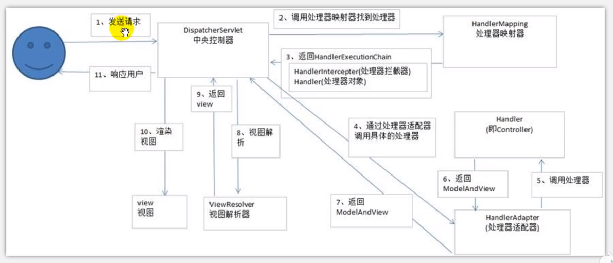
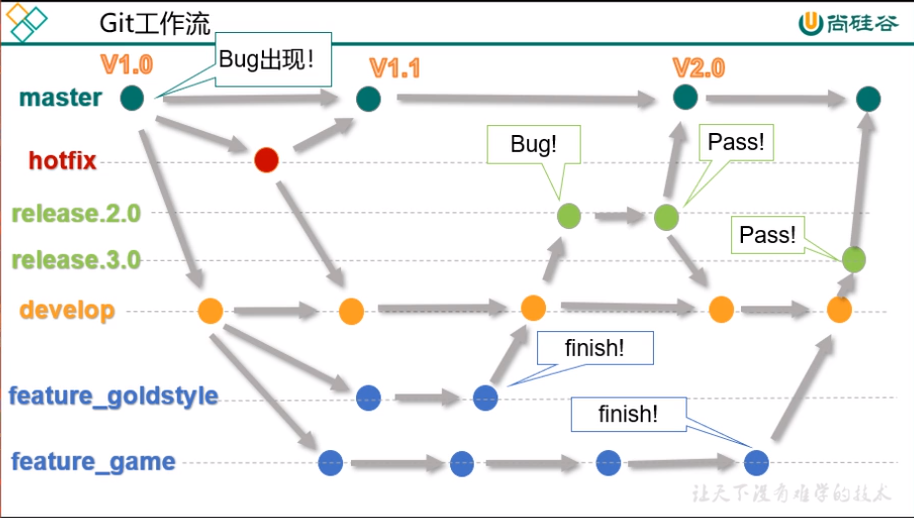
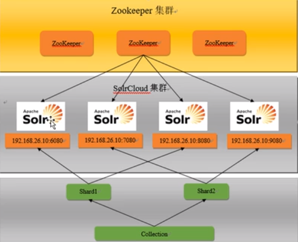
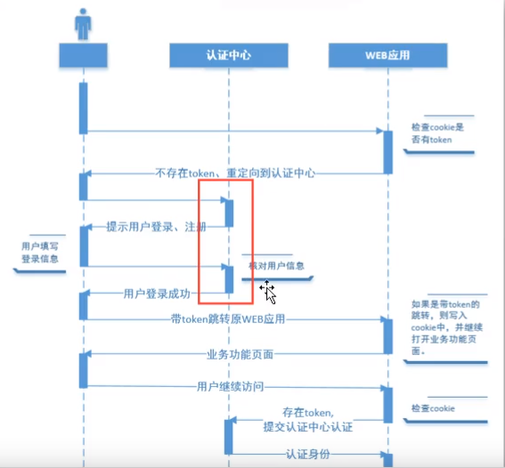
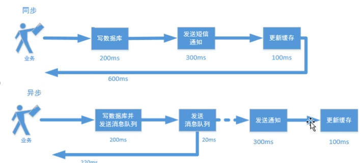
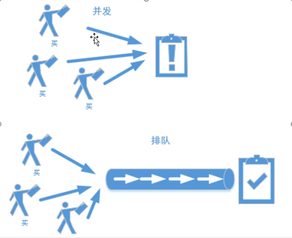
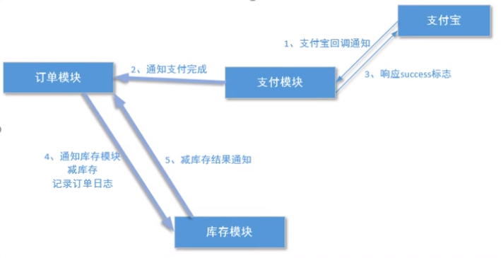

# 参考链接

[尚硅谷Java学科之第一季Java面试题_哔哩哔哩 (゜-゜)つロ 干杯~-bilibili](https://www.bilibili.com/video/av35040927?p=17)

# Java SE面试题

## 自增变量

* `i++`
  * 把i的值压入操作数栈
  * i变量自增1
* `++i`
  * i变量自增1
  * 把i的值压入操作数栈

示例：

* `i = i++`
  * 把i的值压入操作数栈
  * i变量自增1
  * 把操作数栈中的值赋值给i
* `k = i+ ++i * i++`
  * 把i的值压入操作数栈
  * i变量自增1
  * 把i的值压入操作符栈
  * 把i的值压入操作数栈
  * i变量自增1
  * 把积的结果压入操作数栈
  * 把操作数栈中的值弹出求和，然后赋值给k

小结：

* 赋值运算最后计算
* `=`右边的从左到右加载值依次压入操作数栈
* 实际先算哪个，看运算符优先级
* 自增、自减操作都是直接修改变量的值，不经过操作数栈
* 最后的赋值之前，临时结果也是存储在操作数栈中
* 可以参考解释器设计模式的设计思路

## 单例模式

* 饿汉式 - 静态常量（简洁直观）
* 饿汉式 - 静态代码块（适合复杂的实例化）
* 懒汉式（线程不安全）
* 懒汉式 - 同步方法（线程安全，效率低）
* ~~懒汉式 - 同步代码块（错误的写法）~~ 
* 双重校验锁（线程安全，效率高）
* 静态内部类（线程安全，基于JVM自身机制）
* 枚举（简洁，线程安全，基于JVM自身机制，限制反射）

## 类初始化和实例初始化

类初始化过程：

* 一个类要创建实例需要先加载并初始化该类
  * main方法所在的类需要先加载和初始化
* 一个子类要初始化需要先初始化父类
* 一个类初始化就是执行`<clinit>()`方法（JVM生成的不可见方法）
  * `<clinit>()`方法由静态变量显示赋值代码和静态代码块组成 
  * 静态变量显示赋值代码和静态代码块代码从上到下顺序执行
  * `<clinit>()`方法只执行一次

实例初始化过程：

* 实例初始化就是执行`<init>()`方法（JVM生成的不可见方法）
  * `<init>()`方法可能重载有多个，有几个构造器就有几个`<init>()`方法
  * `<init>()`方法由实例变量显示赋值代码和非静态代码块、对应构造器代码组成
  * 实例变量显示赋值代码和非静态代码块代码从上到下顺序执行，而对应构造器的代码最后执行
  * 每次创建实例对象，调用对应构造器，执行的就是对应的`<init>()`方法
  * `<init>()`方法的首行是任意`super()`方法，即对应父类的`<init>()`方法（即使不写）

方法的重写：

* 当子类构造器调用`super()`方法时，调用的是重写后的对应方法
* 哪些方法不可以重写
  * 静态方法
  * final方法
  * 子类中不可见的方法如私有方法
* 对象的多态性
  * 子类如果重写了父类的方法，通过子类对象调用的一定是子类重写过的方法
  * 非静态方法的默认调用对象是this
  * this对象在构造器或者说`<init>()`方法中就是正在创建的对象

## 方法的参数传递机制

**Java中的方法只有值传递，没有引用传递。**

方法的参数传递机制：

* 当形参是原始类型时，传递数据值（值）
* 当形参是引用类型时，传递地址值（地址）
* 某些特殊的引用类型（String、包装类等）具有不可变性

栈、堆和常量池：

* 栈中存储的是地址或原始类型常量，地址引用堆中的对象或常量池中的常量。
* 堆中存储的是对象。
* 常量池中存储的是字符串常量、范围之内的包装类型常量等。
* Integer类的常量池范围是-128到127。

## 递归和迭代

问：有n步台阶，一次只能上1步或者2步，共有多少种写法？

[用递归实现](../src/main/java/com/windea/study/interview/misc/Question1.java#L15-L23)

* n=1 -> 走1步
* n=2 -> (1) 1步1步 (2) 直接走两步
* n>=3 -> (1) 先到达f(n-1)，然后从f(n-1)直接跨2步 (2) 先到达f(n-2)，然后从f(n-2)直接跨2步
* 用递归计算两种情况的结果的和

[用迭代实现](../src/main/java/com/windea/study/interview/misc/Question1.java#L25-L41)

* n=1 -> 走1步
* n=2 -> (1) 1步1步 (2) 直接走两步
* n=3 -> (1) 先到达f(n-1)，然后从f(n-1)直接跨2步 (2) 先到达f(n-2)，然后从f(n-2)直接跨2步
* 用两个变量保存两种情况的结果 

小结：

* 方法调用自身称为递归，利用变量的原值推出新值称为迭代
* 递归
  * 优点：大问题转化为小问题，可以减少代码量，同时代码简洁，可读性好
  * 缺点：递归调用浪费了空间，而且递归太深容易造成堆栈的溢出
* 迭代
  * 优点：代码运行效率好，因为时间只因循环次数增加而增加，而且没有额外的空间开销
  * 缺点：代码不如递归简洁，可读性不好

## 成员变量与局部变量

新近原则：寻找最近声明且在作用域范围内的同名变量    

变量的分类：

* 成员变量：类变量、实例变量
* 局部变量

局部变量与成员变量的区别：

* 声明的位置
  * 局部变量：方法体中、形参、代码块中
  * 成员变量：类中方法外（类的静态变量，实例的成员变量）
* 修饰符
  * 局部变量：只有`final`
  * 成员变量：可见性修饰符、`static`、`final`、`transient`、`volatile`
* 值存储的位置
  * 局部变量：栈（存储的是地址）
  * 实例变量：堆
  * 类变量：方法区（元空间）
* 作用域
  * 局部变量：从声明处开始，到所属的`}`结束
  * 实例变量：在当前类中使用`this.xxx`（`this.`有时可省略），在其他类中使用`对象名.xxx`访问
  * 类变量：在当前类中使用`类名.xxx`（`类名.`有时可省略），在其他类中使用`类名.xxx`或`对象名.xxx`访问
* 生命周期
  * 局部变量：每一个线程，每一次调用执行都是新的生命周期
  * 实例变量：随着对象的创建而初始化，随着对象的被回收而消亡，每个对象的实例变量都是独立的
  * 类变量：随着类的初始化而初始化，随着类的卸载而消亡，该类的所有对象的类变量都是共享的

非静态代码块的执行：每次创建实例对象都会执行

方法的调用规则：调用一次执行一次 

# SSM面试题

## Spring Bean的作用域

* singleton：默认值，单例。当IOC容器创建就会自动创建bean的实例，每次得到的都是同一个
* prototype：原型。当IOC容器创建时不会自动创建bean的实例，每次调用`getBean()`方法时都会返回一个新的实例
* request：每次http请求都会创建一个新的实例。仅适用于WebApplicationContext环境
* session：在同一个http会话共享一个实例，不同的http会话使用不同的实例。仅适用于WebApplicationContext环境

## Spring支持的常用事务传播属性和事务隔离级别

事务的传播行为（propagation）：

当事务方法被另一个事务方法调用时，必须指定事务应该如何传播。例如方法可能继续在现有事务中运行，也可能开启一个新事务，并在自己的事务中运行。

* REQUIRED：使用原来的事务，如果没有则创建（默认值）
* REQUIRES_NEW：使用新的事务，如果已有则挂起
* SUPPORTS：使用原来的事务，如果没有则不使用
* NOT_SUPPORTED：不使用事务，如果已有则挂起
* MANDATORY：使用原来的事务，如果没有则抛出异常
* NEVER：不使用事务，如果已有则抛出异常
* NESTED：使用原来的事务的嵌套事务，如果没有则创建

事务的隔离级别（isolation）：

数据库系统必须具有隔离并发运行各个事务的能力，使它们不会互相影响，避免各种并发问题。一个事务与其他事务隔离的程度称为隔离级别。SQL标准中规定了多种事务隔离级别，不同隔离级别对应不同的干扰程度，隔离级别越高，数据一致性就越好，但并发性越弱。

* READ_UNCOMMITTED：读未提交，允许t1读取t2未提交的修改
* READ_COMMITTED：读已提交，解决脏读问题，限制t1只能读取t2已提交的修改（Oracle的默认隔离级别）
* REPEATABLE_READ：可重复读，解决不可重复读问题，确保t1可以多次从一个字段中读取到相同的值，t1执行期间，禁止其他事务对这个字段进行更新操作（MySQL的默认隔离级别）
* SERIALIZABLE：串行化，解决幻读问题，确保t1可以多次从一个表中读取到相同的行，t1执行期间，禁止其他事务对这个表进行添加、更新、删除操作。可以避免任何并发问题，但是性能低下。

读取数据时遇到的问题：

* 脏读：当前事务读取到了另一个事务没有提交的数据
* 不可重复读：当前事务读到的另一个事务修改数据前后的数据不一致
* 幻读：当前事务读到的另一个事务插入数据前后的多条数据不一致

## Spring MVC中解决GET和POST的中文乱码问题

**最简单的解决方法：使用Spring Boot……**

解决GET请求：

* 打开tomcat目录下的`server.xml`文件
* 为第一个`Connector`标签添加属性`URIEncoding="UTF-8"`

解决POST请求：

* 配置过滤器`CharacterEncodingFilter`。
* 可以使用xml配置，其中`init-param`用于设置过滤器的属性值。
* 属性`encoding`表示对request的编码方式。
* 属性`forceEncoding`表示是否对response编码。

## Spring MVC的工作流程



## MyBatis中当实体类中的属性名和表中的字段名不一样时怎么办

* 写sql语句时起别名
  * 示例：`select id, lastName last_name from user;`
* 在MyBatis的全局配置文件中开启驼峰命名规则（名字必须是对应的）
  * 在`mybatis-config.xml`中：在`settings`标签下添加`<setting name="mapUnderscoreToCamelCase" value="true">`
* 在mapper文件中使用resultMap来自定义映射规则

```xml
<resultMap type="..." id="...">
  <id column="id" property="id"/>
  <result column="last_name" property="lastName"/>
</resultMap>
```

# Java高级面试题

## Linux常用服务类的相关命令

service（centos6）

* 注册在系统中的标准化程序
* 有方便统一的管理方式（常用的方法）
  * `service 服务名 start`  
  * `service 服务名 stop`  
  * `service 服务名 restart`  
  * `service 服务名 reload`
  * `service 服务名 status`
* 查看服务的方法：`etc/init.d/服务名`
* 通过chkconfig命令设置自启动
  * 查看服务：`chkconfig --list|grep 服务名`
  * 设置自启动：`chkconfig --level 5 服务名 on`

systemctl（centos7）

> ctl是control的缩写

* 注册在系统中的标注化程序
* 有方便统一的管理方式（常用的方法）
  * `systemctl start 服务名`
  * `systemctl restart 服务名`
  * `systemctl stop 服务名`
  * `systemctl reload 服务名`
  * `systemctl status 服务名`
* 查看服务的方法：`/usr/lib/systemd/system`
* 查看服务的命令
  * `systemctl list-unit-files`
  * `systemctl --type service`
* 通过systemctl命令设置自启动
  * 自启动：`systemctl enable 服务名`
  * 不自启动：`systemctl disable 服务名`

Linux系统的7种运行级别（常用的是级别3和5）

* 运行级别0：系统停机状态，系统默认运行级别不能设为0，否则不能正常启动
* 运行级别1：单用户状态，root权限，用于系统维护，禁止远程登录
* 运行级别2：多用户状态（没有NFS），不支持网络
* 运行级别3：完全的多用户状态（有NFS），登录后进入控制台命令行模式
* 运行级别4：系统未使用，保留
* 运行级别5：X11控制台，登录后加入图形GUI模式
* 运行级别6：系统正常关闭并重启，系统默认运行级别不能设为6，否则不能正常启动

## git分支常用命令和实际应用

* 创建分支
  * `git branch 分支名`
* 查看分支
  * `git branch -v 分支名`
* 切换分支
  * `git checkout 分支名`
* 创建并切换到分支：
  * `git checkout -b 分支名`
* 合并分支
  * 先切换到要合并到的分支，如主分支：`git checkout master`
  * `git merge 分支名`
* 删除分支
  * 先切换到主分支：`git checkout master`
  * `git branch -D 分支名`（即使没合并，`-d`是对于已合并的分支）



## redis持久化

RDB

* 在指定的时间间隔内将内存中的数据集快照写入磁盘，也就是snapshot快照，它恢复时是将快照文件直接读到内存里。
* redis会单独创建一个子进程来进行持久化，会优先将数据写入到一个临时文件中，待持久化过程都结束了，再用这个临时文件替换上次持久化好的文件。整个过程中，主进程是不进行任何IO操作的，这就确保了极高的性能。如果需要进行大规模数据的恢复，且对于数据恢复的完整性不是非常敏感，那么RDB方式要比AOF方式更加高效。RDB的缺点是最后一次持久化后的数据可能丢失。
* 优点：
  * 节省磁盘空间
  * 恢复速度快
* 缺点：
  * 虽然redis在fork时使用了写时拷贝技术，但是如果数据庞大时还是比较消耗性能。
  * 在备份周期在一定间隔时做一次备份，所以如果redis意外终止掉的话，就会丢失最后一次快照之后的所有修改。 

AOF

* 以日志的形式来记录每个写操作，将redis执行过的所有写指令记录下来（读操作不记录），只许追加文件但不可以改写文件，redis启动之初会初始化该文件重新构建数据，换言之，redis重启的话就根据日志文件的内容，将写指令从前到后执行一次以完成数据的恢复操作。
* 优点：
  * 备份机制更稳健，丢失数据概率更低
  * 可读的日志文本，通过操作AOF文件，可以处理误操作
* 缺点：
  * 比起RDB占用更多的磁盘空间
  * 恢复备份速度更慢
  * 每次读写都同步的话，有一定的性能压力
  * 存在个别bug，造成恢复不能

## MySQL什么时候建索引

索引的简介

* 定义
  * 索引是帮助MySQL高效获取数据的数据结构
  * 可以得到索引的本质：索引是数据结构
  * 可以简单理解为“排好序的快速查找数据结构”
  * 一般来说索引本身也很大，不可能全部存储在内存中，因此往往以索引文件的形式存储在磁盘上
* 优势
  * 提高数据检索的效率，降低数据库的IO成本
  * 通过索引对数据进行排序，降低数据排序的成本，减少CPU的消耗
* 劣势
  * 虽然索引大大提高了查询速度，同时却会降低更新表的速度。因为更新表时，不仅要保存数据，还需要更新索引文件
  * 实际上索引也是一张表，该表保存了主键和索引字段，并指向实体类的记录，所以索引列也是要占用空间的
* 哪些情况需要创建索引
  * 主键自动建立唯一索引
  * 频繁作为查询条件的字段应该创建索引
  * 查询中与其他表关联的字段，外键关系建立索引
  * 单键/组合索引的选择问题：组合索引性价比更高
  * 查询中排序的字段，排序字段若通过索引去访问，将会大大提高排序速度
  * 查询中统计或者分组字段（分组包含排序）
* 哪些情况不要创建索引
  * 表记录太少
  * 经常增删改的表或者字段
  * where条件里用不到的字段不要创建索引
  * 过滤性不好的不适合创建索引（布尔值？）
  
## JVM垃圾回收机制

GC发生在JVM的哪个部分：堆  

GC是什么（分代收集算法）  
* 次数上频繁收集Young - Minor GC
* 次数上较少收集Old - Full GC
* 基本不动Perm（永久区）

GC四大算法
* 引用计数法
  * 原理：只要对象之间有引用，就不进行垃圾回收
  * 应用：微软的com/ActionScript3/Python
  * 缺点：
    * 每次对象赋值时均需维护引用计数器，且计数器本身也有一定消耗
    * 较难处理循环引用
  * JVM的实现一般不采用这种方式
* 复制算法
  * 年轻代中使用的是Minor GC，这种GC算法采用的就是复制算法
  * 原理：
    * 从根集合（GC Root）开始，通过Tracing从From中找到存活对象，拷贝到To中
    * From、To交换身份，下次内存分配从To开始
  * 优点：
    * 没有标记和清除的过程，效率高
    * 没有内存碎片，可以利用bump-the-pointer实现快速内存分配
  * 缺点：
    * 需要双倍空间
* 标记清除算法
  * 老年代一般是由由标记清除或者标记清除与标记整理的混合实现
  * 原理：
    * 标记：从根集合开始扫描，对存活的对象进行标记。
    * 清除：扫描整个内存空间，回收被标记的对象
  * 优点：
    * 不需要额外空间
  * 缺点：
    * 两次扫描，耗时严重
    * 会产生内存碎片
* 标记压缩算法
  * 老年代一般是由由标记清除或者标记清除与标记整理的混合实现
  * 原理：
    * 标记与清除：与前者一样
    * 压缩：再次扫描，并往一端滑动存活对象
  * 优点：
    * 没有内存碎片，可以利用bump-the-pointer实现快速内存分配
  * 缺点：
    * 需要移动对象的额外成本
* 标记清除压缩算法
  * 原理：和前者类似，但是当进行多次GC后才执行压缩操作
  * 优点：
    * 减少移动对象的成本  

# 项目面试题

## Redis在项目中的使用场景

* string
  * 示例：什么时候封锁一个id地址
* hash
  * 示例：存储用户信息
  * 插入数据：`hset(key,field,value)`
  * 得到数据：`hget(key,field)`
  * 不建议使用string类型存储用户信息
  * 为什么不使用string类型存储：需要将数据全部反序列化，增加io次数，降低缓存性能
* list
  * 示例：最新消息的排行，电商项目的秒杀功能
  * 插入数据：`lpush(element)`
  * 得到数据：`lpop()`
* set
  * 特殊之处：可以自动排重
  * 示例：两个人的共同好友
* zset
  * 特殊之处：可以以某个条件为权重进行排序
  * 示例：对字段进行排序

## ElasticSearch和solr的区别

背景：
* 它们都是基于Lucene搜索服务器的优秀的、高性能的企业级搜索服务器。
* 因为它们都是基于分词技术构建的倒排索引的方式进行查询。

开发语言：都是基于java进行开发的

开发时间：
* solr：2004年
* es：2010年
* 相对来说，es的功能更加强大

区别：
* 当实时建立索引的时候，solr会产生io阻塞，而es则不会，因此性能相对较高。
* 在不断动态添加数据的时候，solr的检索效率会变得低下，而es则没有什么变化。
* solr利用zookeeper进行分布式管理，es则自身带有分布式系统管理功能。
* solr一般需要部署到web服务器，如tomcat，同时配置两者之间的关联。（solr的本质是一个动态web项目）
* solr支持更多的格式数据（xml、json、csv），而es仅支持json文件格式。
* solr是传统搜索应用的有力解决方案，es更适用于新兴的实时搜索应用。（单纯对已有数据进行检索的时候，solr效率更高）
* solr官网提供的功能更多，es本身更注重于核心功能，一些高级功能需要第三方插件提供 。



## 单点登录实现的过程

* 单点登录：一处登录，多处使用
* 前提：单点登录多使用在分布式系统中



京东的单点登录，是将token放入到cookie中的。

## 购物车实现过程

* 购物车与用户的关系
  * 一个用户必须对应一个购物车
  * 单点登录一定在购物车之前
* 购物车的相关操作
  * 添加购物车
    * 用户未登录
      * 添加到什么地方 → redis、cookie、localStorage   
    * 用户已登录
      * redis缓存（为了读写速度），数据库（为了稳健性）
  * 展示购物车
    * 用户未登录
      * 直接从cookie中取出数据即可
    * 用户已登录
      * 用户一旦登录，必须s显示数据库/缓存+cookie中的数据    
  * 存储在redis中时，必须使用hash类型存储。

## 消息队列在项目中的使用

背景：在分布式系统中如何处理高并发

由于在高并发的环境下，来不及同步处理用户发送的请求，则会导致请求发生阻塞，比如说，大量的insert、update之类的请求同时到达数据库MySql，直接导致无数的行锁表锁，甚至会导致请求堆积很多，从而触发too many connections错误。使用消息队列可以解决**异步通信**。

异步：



并行：


排队：



消息队列在电商中的使用场景



消息队列的弊端：

* 消息的不确定性（采用延迟队列和轮询技术来解决该问题）

推荐使用ActiveMq，因为环境是java。大数据需要使用kafka。
