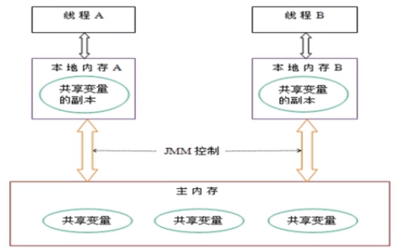
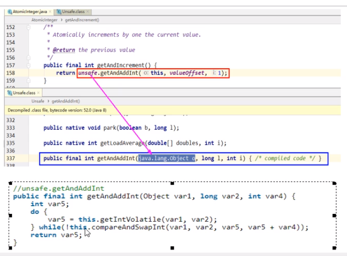

# JUC多线程与高并发

## volatile

测试代码：[VolatileDemo.java](../../src/main/java/com/windea/study/interview/concurrent/VolatileDemo.java)

### volatile是什么

volatile是Java虚拟机提供的轻量级的同步机制。

volatile的三大特性：
* 保证可见性
* 不保证原子性
* 禁止指令重排

> 关于n++：
> * 执行getfield拿到原始的n
> * 执行iadd进行加1操作
> * 执行putfield将累加后的值写回

如何解决volatile原子性的问题：
* 使用synchronized进行同步（不建议）
* 使用juc的AtomicInteger等

Atomic的低层原理：CAS
* +Unsafe类
* +自旋锁

### 关于JMM

JMM（Java内存模型）本身是一种抽象的概念并不真实存在，它描述的是一组规则或规范，通过这组规范定义了程序中各个变量（包括实例字段、静态字段和构成数组对象的元素）的访问方式。

JMM关于同步的规定：
* 线程解锁前，必须把共享变量的值刷新回主内存
* 线程加锁前，必须读取主内存的最新值到自己的工作内存
* 加锁解锁是同一把锁

由于JVM运行程序的实体是线程，而每个线程创建时JVM都会为其创建一个工作内存（栈空间），工作内存是每个线程的私有数据区域，而Java内存模型中规定所有变量都存储在主内存，主内存是共享内存区域，所有线程都可以访问，~但线程对变量的操作必须在工作内存中进行。首先要将变量从主内存拷贝到自己的工作空间，然后对变量进行操作，操作完成后再将变量写回主内存。~不能直接操作主内存中的变量，各个线程中的工作内存中存储着主内存中的变量副本拷贝，因此不同线程之间无法访问对方的工作内存，线程间的通信必须通过主内存完成。

JMM的三大特性：
* 可见性
* 原子性
* 有序性

> * 可见性：某个线程修改了主内存的值后，其他线程应当立刻获得通知。
> * 原子性：某个线程执行的某个具体业务，要么同时，完成同时失败。
 
### 关于有序性

计算机在执行程序时，为了提高性能，编译器和处理器常常会对指令做重排，一般分为以下三种：
* 单线程环境里面确保程序最终执行结果和代码顺序执行的结果一致。
* 处理器在进行重排序时必须要考虑指令之间的数据依赖项。
* 多线程环境中线程交替执行，由于编译器优化重排的存在，两个线程中使用的变量能否保证一致性是无法确认的，结果无法预测。

禁止指令重排：在多线程编程中，保证最终结果的一致性

禁止指令重排小结（了解）：

> volatile实现禁止指令重排优化，从而避免多线程环境下程序出现乱序执行的现象。
> 
> 先来了解一个概念，内存屏障（Memory Barrier）是一个CPU指令，它的作用有两个：
> * 保证特定操作的执行顺序。
> * 保证某些变量的内存可见性（以实现volatile的内存可见性）
> 由于编译器和处理器都能执行指令重排优化，如果在指令间插入一条Memory Barrier则会告诉编译器和CPU，不管什么指令都不能和这条指令重排序，也就是说通过插入内存屏障禁止在内存屏障前后的指令执行重排序优化。内存屏障的另一个作用是强制刷出各种CPU的缓存数据，因此任何CPU上的线程都能读取到这些数据的最新版本。

### 如何保证线程安全性

工作内存与主内存同步延迟现象导致的可见性问题：可以使用synchronized或volatile关键字解决，它们都可以使一个线程修改后的变量立刻对其他线程可见。

指令重排导致的可见性和有序性问题：可以利用volatile关键字解决，因为它的另一个作用就是禁止指令重排。

### 哪些地方会用到volatile

单例模式（双重检查）：[SingletonDemo.java ](../../src/main/java/com/windea/study/interview/concurrent/SingletonDemo.java)

**单例模式的volatile分析：**

双重检查机制不一定线程安全，原因是在指令重排序的存在。加入volatile可以禁止指令重排。

原因在于某一个线程执行到第一次检查时，读取到的instance不为null时，instance的引用对象可能*没有完成初始化*。

`instance = new SingletonDemo();`可以分为以下三步完成：

1. 分配对象内存空间
2. 初始化对象
3. 将instance指向刚分配的内存地址（此时instance != null）

步骤2和步骤3*不存在数据依赖关系*，而且无论重排前还是重排后的执行结果在单线程中并没有改变，因此这种重排优化是允许的。

但是指令重排只会保证串行语义执行的一致性（单线程），但并不会关心多线程间的语句一致性。*所以当一条线程访问instance不为null时，由于instance实例未必已初始化完成，额就造成了线程安全问题。*

## CAS

测试代码：[CasDemo.java](../../src/main/java/com/windea/study/interview/concurrent/CasDemo.java)

### CAS是什么

CAS的全称为Compare And Swap（比较并交换），是一条CPU并发原语。它的功能是判断内存某个位置的值是否为预期值，如果是则更改为新的值，这个过程是原子的。

CAS并发原语体现在Java语言中就是Unsafe类中的各个方法。调用Unsafe类中的CAS方法，JVM会帮我们实现出CAS汇编指令。这是一条完全依赖于硬件的功能，通过它实现了原子操作。

由于CAS是一种系统原语，属于操作系统用语范畴，是由若干条指令组成的，用于完成某个功能的一个过程，并且原语的执行必须是连续的，在执行过程中不允许被中断，也就是说CAS是一条CPU的原子指令，不会造成数据不一致的问题。

### CAS的底层原理，谈谈对Unsafe的理解

Unsafe类和自旋锁。

**Unsafe类**

Unsafe类是CAS的核心类，由于Java方法无法直接访问底层系统，需要通过本地方法来访问。Unsafe相当于一个后门，基于该类可以直接操作特定内存的数据。Unsafe类存在于sun.misc（jdk.internal.misc）包中，其内部方法操作可以像C的指针一样直接操作内存。因此CAS操作的执行依赖于Unsafe类的方法。

注意Unsafe类中的绝大部分方法都是原生方法，即直接调用操作系统底层资源执行相应任务。

> 注意：不同Java版本中的具体实现可能不一致

> 假设线程A和线程B同时执行getAndAddInt操作（分别在不太浓的CPU上）
> * AtomicInteger里面的value原始值为3，即主内存中AtomicInteger的value为3，根据JMM模型，线程A和线程B各自持有一份价值为3的value的副本到自己的工作内存。
> * 线程A通过getIntVolatile拿到value值3，这时线程A被挂起。
> * 线程B也通过getIntVolatile方法拿到value值3，此时刚好线程B没有被挂起并执行compareAndSwapInt方法，比较内存值也为3，成功修改值为4，完成操作。
> * 这时线程A恢复，执行compareAndSwapInt方法比较，发现自己的value值3和主内存中的value值4不一致，说明该值已经被其他线程抢先一步修改过了，因此A线程本次修改失败，*只能重新读取再来一遍*。

总结：比较当前工作内存中的值和主内存中的值，如果相同则执行规定操作，否则继续比较直到主内存和工作内存中你的值一致为止。

Unsafe类中的compareAndSwapInt是一个本地方法，该方法的实现位于unsafe.cpp中。

**自旋锁**

对于getAndAddInt方法，如果操作未能成功，则重新尝试取值并进行操作，直到成功为止。

### CAS的缺点

* 循环时间长，开销很大。
  * 如果CAS失败，会一直进行尝试。如果CAS长时间一直不成功，可能会给CPU带来很大的开销。
* 只能保证一个共享变量的原子操作。
  * 当对一个共享变量执行操作时，我们可以使用循环CAS的方式来保证原子操作。
  * 但是，当对对个共享变量操作时，循环CAS就无法保证操作的原子性，这个时候就可以用锁来保证原子性。
* **（重要）引出ABA问题。**

## 原子类AtomicInteger的ABA问题，原子更新问题

### ABA问题

简单理解：狸猫换太子（虽然最终结果是一致的，但是中间过程中可能发生过更改）

CAS算法实现的一个重要前提，就是需要取出内存中某时刻的数据，并在当下时刻比较并替换，那么在这个时间差内就有可能导致数据的变化。

如何解决ABA问题：使用原子引用AtomicReference

### 原子引用

AtomicReference：原子引用。

AtomicStampedReference：时间戳原子引用。使用类似乐观锁的机制，即将时间戳作为版本号，来解决ABA问题。

## 集合类不安全问题