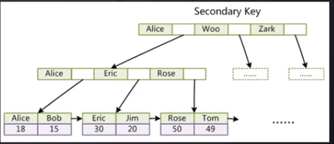

```
# MySQL索引优化实践

## 索引数据结构红黑树、Hash、B+树详解

## 千万级数据表如何用索引快速查找

## 如何基于索引B+树精准建立高性能索引

## 联合索引底层结构又是怎样的

## MySQL索引优化最佳实践
```

[图灵Java架构师学习路线图](https://www.processon.com/view/link/5cb6c8a4e4b059e209fbf369#map)

***

# 索引的本质

索引是帮助MySQL高效获取数据的排好序的数据结构

索引的数据结构
* 二叉树
* 红黑树
* 哈希表
* B树


MySQL的底层使用的是B树和B+树。二叉树在某些情况下存在弊端。

二叉树：某些情况下（如元素是连续递增插入的）可能不平衡，会变成类似链表的结构。

红黑树（通过旋转自平衡的二叉树）：某些情况下（插入数据量很大，查找的元素在叶子节点）性能可能不理想。数据量越大，查找效率越低。

# B树和B+树详细解析

B树：
* +一个节点有多个元素和多个子节点。
* 叶节点具有相同的深度，叶节点的指针为空
* 所有索引元素不重复
* 节点中的数据索引从左到右递增排列。
* 为什么不将所有元素放到一个节点：空间不够，插入的不确定性。


B+树（B树的变种）（一种多叉平衡树）：
* +一个节点有多个元素和多个子节点，非叶子节点只存储索引。
* 非叶子节点不存储数据，只存储索引（冗余），可以放更多的索引。
* 叶子节点包含所有索引字段。
* 叶子节点用指针连接，提高区间访问的性能。
* 为什么要把数据放到叶子节点上：意味着叶子节点存储了完整的索引。


 
哈希：
* 每插入一次元素，对值做一次哈希运算，插入到哈希表中。
* 查找元素时，通过哈希运算，直接找到值。
* 为什么一般不使用哈希：不支持范围查找（B+树支持的很好）
 
> MySQL一次性读入数据大小：
> `show global status like 'Innodb_page_size'`（=16k）（对于B+树索引大小已经足够）

# MyISAM存储引擎索引实现

> 存储引擎是面向数据表的。

MyISAM索引实现（非聚集索引）


* `.frm` 表的结构
* `.MYD` 数据
* `.MYI` 索引

如果有索引，则去MYI文件中根据B+树查找到磁盘文件地址，去MYD文件中一次性查找到数据。

# InnoDB存储引擎索引实现

InnoDB索引实现（聚集索引）
* 表数据文件本身就是按B+树组织的一个索引结构文件
* 聚集索引-叶节点包含了完整的数据记录
* 为什么InnoDB表必须有主键，并且推荐使用整型的自增主键？
  * 因为使用B+树结构，设计如此。
  * 没有建主键，会自动创建一个主键，基于某一唯一字段，或者另外生成。
* 为什么非主键索引结构叶子节点存储的是主键值？
  * 一致性和节省内存空间。




* `.frm` 表的结构
* `.ibd` 数据和索引

> 聚集索引：索引文件和数据文件是放到一块的。

# 索引是怎样支撑千万级表的快速查找

* 通过B+树实现快速查找
* 通过叶子节点之间的（双向）指针支持快速的区间查找。

# MySQL索引优化最佳实践


索引最左前缀原理：如果索引了多列，要遵循最左前缀法则，指的是查询从索引的最左前列开始并且不跳过索引中的列。

* 联合索引的底层结构长什么样？


> **explain工具介绍：**
> 
> 使用explain关键字可以模拟优化器执行sql语句，分析你的查询语句回事结构的性能瓶颈。
> 在select语句之前增加explain关键字，mysql会在查询上设置一个标记，执行查询会返回执行计划的信息，而不是执行这条sql。
> 
> 注意：如果from中包含子查询，仍会执行该子查询，将结果放入临时表中。
> 
> **explain的两个变种：**
> 
> * `explain extended`：会在explain的基础上额外提供一些查询优化信息。紧随其后通过`show warnings`命令可以得到优化后的查询工具，从而看出优化器优化了什么，额外还有一个filtered列，是一个半分比的值，`rows * filtered/100`可以估算出将要和explain中前一个表进行连接的行数（前一个表指explain中你的id值比当前表id值小的表）。
> * `explain partitions`：相比explain多了一个partitions字段，如果查询是基于分区表的话，会显示查询将访问的分区。

（余下略，广告太多）

# JDK体系和JVM架构讲解


# 运行时数据区 栈帧讲解


为什么要有程序计数器：因为有CPU任务调度。


> 可达性分析算法：
> 
> 将GC Roots对象作为起点，从这些节点开始向下搜索引用的对象，找到的对象标记为非垃圾对象，其余未标记的对象都是垃圾对象。
> 
> GC Roots根节点：线程栈的本地变量、静态变量、本地房发展的变量等。（可视为常量）


# 垃圾收集机制分析