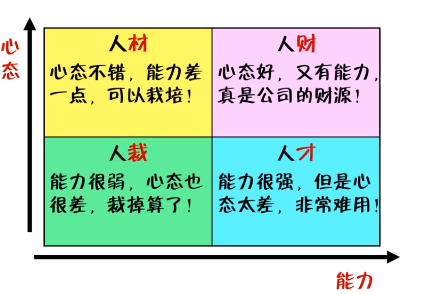

> 明哥（李明老师）好厉害！

# 迈入职场的第一步：选择大于努力

## 职业选择的误区

* 不敢选择
  * 两利相权取其重
  * 两害相权取其轻
* 一直选择
  * 两点之间直线最短
* 不知道怎么选择
  * 把专业当成职业
  * 把兴趣变成工作
    * 你为了兴趣做过哪些疯狂的事情？
    * 你是否为此去学习过做过兼职？
    * 你的兴趣获得过什么荣誉？
    * 如果把兴趣编程职业，你愿意给自己几年时间尝试？
    * 你能够承受最坏的结果吗？

> 与其专于兴趣，不如专于优势

## 职业选择的三个考量点

> 职业选择不要脱离实际
> > 先生存后生活

* 前途和钱途（重要）
* 天赋和特长（重要）
* 兴趣和爱好
* +性格和自身条件

关于问人：问行业内成功的人，多问人

## 职业选择方法论

实验：判断你的职业选择是否有前途

* 工具：百度百聘
* 工具：百度指数

以终为始，谋定而后动！

职业选择：大城市还是小城市，这是一个问题

* 这是生活方式的选择，不是一道判断题
* 基本的选择：要在有鱼的地方撒网

# 什么造型的求职者才能找到好工作

## 企业招聘的识人图

> 能力+心态（声音+心态）

* 一个人的能力，决定他的下限
* 一个人的心态，决定他的上限

你的心态怎么样？

* 实验一：让你最好的朋友写出，看到你的人或听到你的名字时，最先想到的三个形容词。
  * （可爱，上进，勤勉）
* 实验二：写出自己的五个优点和五个缺点
  * （优点：沉稳，乐观，随和，抗压，独行）
  * （缺点：焦虑，不知足，缺乏持久的动力，不懂得欲速则不达的道理，家庭背景造成的性格缺陷）

## 企业想要的两种人

> * 摆正形态，掌握一定的能力，然后慢慢发展 
> * 不管多有本事，都要有个好心态

## 千万不要变成的两种人

千万不要变成的两种人：人才和人裁

* 急于求成的心态→心浮气躁
* 急功近利的心态→不稳定

说法与看法：

* 为啥要我做→团队寄生虫
* 这事不怪我→团队的垃圾
* 这事该找谁→团队的白痴
* 没人来教我→团队的拖累
* 这事我不会→永远是小兵
* 这事我来做→领带左右手
* 这事我顶着→团队顶梁柱
* 这事我负责→团队领导人

# 武装自己的两个技能包

## 学活谋生的一技之长

* 学习的思路
  * 初入职场，一样精通于百样通
  * 一技可以安身立命，之长才能发家致富
* 学习的方法
  * 获取梗概：招聘网站
  * 窃取脉络：培训课程
* 实验
  * 找到自己意向职位的知识图谱

> * 学到很多的东西的诀窍就是：不要一次性学习很多东西
> * 以终为始：招聘企业要什么，我就给什么

## 提升综合的职业素养

> 职业素养=职业技能+职业素质

* 典型的职业技能举例
  * 办公软件的使用
  * 语言表达能力
    * +面试时的自我介绍
  * +电脑使用
  * +英语水平
* 工作经验为什么重要
  * 你是为了自己工作
  * 认真对待工作汇报
    * +这不是负担，而是表现的机会
    * +做好工作是基本要求，超出预期是才有升职可能
    * +做的所有事都要让领导知道
  * 重视工作中的细节
    * +不要迟到，不要有错别字，开会带笔头
  * 管理好自己的情绪
  * 错了就认，认了就改
  * 养成反馈的意识和习惯
  * 不埋怨，不抱怨，不混日子
  * 给结果，说功劳，少秀悲情
    * +老板看的是利弊，不是公正
  * 说数据，说方案，勤于思考
    * 不要问答题，不要判断题，而是要选择题
  * 提升自身价值，才会有人脉
    * +人脉的本质是资源对等和价值交换  

## 企业招聘的隐藏考察点

招聘最重要的是：匹配

* +性格与职业匹配
* +性格与团队匹配
* +性格与价值观匹配

技巧：观察招聘要求中的企业文化和企业理念的描述

# 写简历最重要的两个字：好看

## HR如何筛选简历

> * 最佳的写简历的时间：未雨绸缪找准备。
> * 干净好看、赏心悦目、一目了然。
> * 专注点：专业技能、工作经验、证书等
> * 第一要素：合理性（在简历上不要出现逻辑错误）
> * 核心：投其所好

* 你为什么没有面试邀约
  * 简历写得不好
  * 简历投得不好

参照着招聘要求写简历

* HR筛选简历的姿势
  * 是快速浏览，而不是仔细阅读
  * 是寻找关键词，而非逐句分析
* HR最讨厌的三种简历
  * 又臭又长→简单有力
  * 千篇一律→与众不同
    * +把一样的事用不一样的方法表达出来  
  * 含糊不清→交代具体
    * +明确具体的指标
    * +写简历时不要和HR抖机灵  

## 简历形式上的好看

> * 先做一份word版的简历，然后据此编写在线简历
> * 简历好看是一个非常重要的加分项

HR没有义务去发现你的内在美

实验：QQ邮箱的简历功能

## 简历内容上的好看

细节决定成败

* +不要有错别字，英文大小写要统一，全半角要统一
* +word板的简历要满页呈现
* +简历中的用词要精炼准确，摆数据，亮结果
* +具体的数字、具体的结果、具体的事实
* +不要写“熟悉”，而要写“熟练掌握”
* +不要出现口语化的用词

让HR更方便，而不是自己更方便

* +把HR最想看的往前面放
* +把专业技能、工作经验和项目经验等放前面
* +不要把自我评价和兴趣爱好等放前面
* +教育经历要倒叙

简历制作的原则是，趋利避害

* +应该告诉面试官真相，大不需要告诉面试官全部真相

# 庖丁解牛：简历编写注意事项

> 先问问自己能为招聘企业做什么，不要问招聘企业能为你做什么

## 基本资料（硬性指标）

* 姓名
* 性别
* 民族
* 籍贯
* 现居住地
* 联系方式（非常重要，手机号码+电子邮箱）
* 出生日期
* 学历
* 外语水平
* 婚姻状况
* 照片（正式的）

原则：（必不可少的项）不欲盖拟彰，（可有可无的项）也不自暴其短

## 求职意向

* 意向职位（只写一个）
* 意向城市（专门的城市投专门的公司）
* 所属行业（不要局限）
* 期望薪资（很重要很复杂，业内谈默认是税前）

做痴情小种子，不要做花心大萝卜

## 教育经历

* 从高中开始即可
* 时间按照倒序记叙
* 告诉HR你学会了什么，而不是你学了什么

## 个人技能（重点）

* 一归纳，二主次，三行文
* 用词上可以更上一层楼

注意细节：

* 大小写要统一

例子：

* 会Linux常用命令，能在Linux上搭建LAMP环境
* 改为：掌握Linux日常管理操作，熟悉Linux服务器的LAMP环境部署、优化和安全

## 工作经历（重点）

* 任何工作经历都要写上，写清楚
* 尽量不要频繁跳槽
* 如果企业非常知名，可以简单交代一下
* 介绍职务的时候，可以介绍工作职责，列出发光点
* 最重要的是成功

告诉HR你是怎么做好这份工作的，而不是这份工作是做什么的

## 项目经验（重点）

> 可以写毕业设计

5W1H：Who、When、Where、How、Why、What

标准：一真，二实，三扩展

* 结果大于过程
* 表述出自己的能力，例如创新能力，解决问题能力，学习能力
* 可以给出相应的过程

## 获奖情况

* 求职相关的往前写（知识运用大于成绩）

## 自我评价

* 突出与众不同的能力和经历（可以结合家庭背景）
* 事实求是，用事实和数据支撑（提前做好被追问的准备）
* 回避不利的联想信息（例如不必要写出的兴趣爱好）
* 表达自己的求职意愿

# 简历投递七字诀：胆大、心细、脸皮厚

> 合适的时间，遇到合适的人

## 撑死胆大的，饿死胆小的

招聘要求写得高大上是人之常情

* 即便不满足几条要求，简历仍然可以投过去
* 警惕含糊的招聘要求
* 公司可能会和自己玩套路，因为能力不足而降低薪资

为什么招聘要求一直挂在那里？

* 公司没有相中你
* 公司现在没有在招人（品牌宣传，放到人才库备用）
* 没拿到offer之前，就要勤快而心细

## 心中有猛虎，细能嗅蔷薇

多投几家简历公司：

* 老牌的：智联招聘，前程无忧，中华英才

投递简历的最佳时间：

* 周二、周三、周四
* 周三上午最佳
* 上午9点到11点最佳，下午1点到3点最佳

不建立盲投：

* 针对性的投递，不要一份简历打天下
* 不熟悉某项技能，也可以说了解，到时候再临阵磨枪
* 针对性的投递和海投，二者结合投递

如何发求职邮件：

* 意图明确的标题（应聘职位信息，优势，到岗时间）
* 大有讲究的正文
  * 简历最好正文中一份，附件中一份
  * 如果是应届生，还可以写求职信，说明个人能力与与众不同之处
* 有备无患的附件（doc或pdf）
* 不可忽略的细节
  * 注意邮箱的昵称和个人介绍
  * 注意称呼，如果不知道，可以直接用“你好”
* +让HR更方便

## 脸皮薄吃不着，脸皮厚吃个够

* 可不可以投之前据过的公司？
  * 可以，投了有希望，不投没希望
* 过了约定的时间能不能询问结果？
  * 可以，该问就问
* 发了offer被我拒了，现在想吃回头草怎么办？
  * 可以，浪子回头HR会很开心，只要理由合情合理
  * 不要把自己当一回事，最看重的还是自己的能力

## 纸质简历的小细节

* 简历一定要带
* 简历一定要装好（档案袋，不能涂改）
* 双手投递简历，文字朝向对方再投递

##  讨论：只有找工作时才需要写简历吗？

* 简历就是对自己的检讨，最好没半年更新一次
* 在工作中记录
* 在记录中总结
* 在总结中反省
* 在反省中成长

注意：不要在线更新简历，被自己的HR发现了

# 知己知彼：面试形式大揭秘

> 没拿到offer之前，一切都是虚幻

## 非肉身接触型：电话面试和视频面试

原因：初步筛选，或者求职者在异地

电话面试的注意事项：

* 提前准备
  * +开卷考试，可以作弊
* 保持礼貌
  * +开头问好，结束表示感谢，记好必要的信息
  * +让面试官先挂（尊者为先）
* 主动选择通话时间和地点
  * 如果场合不合适，首先表达歉意，然后约定其他时间回电话
* 注意语调语气
* 保持专注
* 适当反问
  * 面试结果何时通知，工作具体做什么，未来在公司有什么发展机会等

打电话看不到你的表情，但可以听到你的表情

视频面试的注意事项

* 做好准备工作
  * +背景要干净整洁
  * +注意灯光
* 建立美好形象
  * +穿着打扮干净整洁，大方得体
  * +保持微笑，放松，身体向前倾
  * +如果使用电脑，看着摄像头下面一点点

视频面试，要给面试官一个光辉灿烂的形象

不要打断面试官说话

## 肉身轻度接触型：技能测试和性格测试

* 现场展示专业技能
* 笔试题

关于笔试题

* 笔试题不会很正常，但不要瞎写
* 胡编乱造只是在告诉面试官：你喜欢找借口

实验：菲尔人格测试

## 肉身重度接触型：单挑或群殴的游戏

多个面试官的情况

* 分辨主面试官（话少，只问核心问题）
* 重视每个面试官
* 发现可能的“同志”

多个应聘者的情况

* 自我介绍时多花点心思，例如不一样的开场白
* 贬低别人永远抬高自己

无领导小组讨论

* 接受问题，成员各自分别准备发言提纲
* 小组成员轮流发言，阐述自己的观点
* 成员交叉讨论，渐渐得出最佳方案
* 总结方案并汇报讨论结果

情景模拟

* 文件筐测试
* 角色扮演
* 管理游戏

## 验明正身型：背景调查

* 核查以前的工作经历
* 永远不要在职场混日子

# 形象塑造：看起来就像个成功者

> 颜值即正义

## 一见钟情：致命的第一印象

> 一个人的初步影响力几乎永远是视觉上的。  
> > 在我们真正了解一个人之前，我们在看到他时，便形成了对他的看法。如果他的样子顺眼，我们就会在他身上寻找好的特质；如果他的样子不讨人喜欢，我们就会倾向于探索他不良的特质，以便支持我们的第一次判断。  
> > 一个人给人的第一印象是难以泯灭的。
> > ——蓝斯登

以貌取人，虽然不高尚，但这是社会现实

只要有人参与的事，就有主观的因素在

商务礼仪

* 头发
  * 男性：前不抵眉，侧不掩耳，后不及领
  * 女性：宁愿长发及腰，也不要披肩散发
  * +年轻人可以有点个性
* 眼睛
  * 面试前不要通宵
* 口腔
  * 面试前不要吃有异味的食物

我们无法要求别人不以貌取人，但可以要求自己不以貌取人

自信，才是一个人最好看的那张脸

## 看起来就像个成功者

找工作时是否需要穿正装：销售类有必要，技术类只要不要太随意

正式场合要穿得正式一点

首先是给自己的一种感觉，然后才是给别人看的

没人有义务通过你邋遢的外表去发现你优秀的内在

## 谈举止显性格

* 坦诚：更容易赢得别人的好感
* 给面试官肯定且正确的回复（不要模棱两可）
* 越是能在紧张的氛围下开玩笑的人，越是有自信的人
  * 保持幽默感，适当地开玩笑
* 让对方把话讲完，是一种能力更是一种修养
  * 注意倾听，不要打断面试官的讲话，不要与之争辩
  * 不要眼神一直对视面试官，只在需要的时候看一下
  * 看发际线到耳朵小三角，更熟悉的人看眼睛之间的倒三角
* 眼睛是心灵的窗户，你不能面试的时候把窗户关上
* 人在心情不好的时候，会对标准要求更高
  * 保持微笑
  * 在成年人的世界里，笑只是一种表情，而非心情
* 礼仪的顺序问题讲究四个字：尊者优先
  * 握手的时间要适中
  * 握手时要摘下帽子、手套等
  * 面试时，电话要调成静音或震动

> 细节：椅子放原位，水杯倒掉和扔垃圾桶

# 面试赴约前的准备工作

## 给你一双慧眼识破求职陷阱

天上掉下个馅饼，地上一定有个陷阱

典型的求职陷阱

* 万恶的传销（比避免直销）
  * 电话联系的时候，一定要求得公司名，然后去查证
  * 电话面试过于简单的时候，一定要谨慎
* 坑人的沼转
  * 挂着招聘的羊头，卖着培训的狗肉
  * 一般的公司，标题不会过于详细
  * 不管面试公司，只要交钱的，包括从工资中扣，基本就是骗子
* 廉价劳动力
  * 打着招聘的名义，窃取求职者的信息
  * 以招聘考试的名义，让自己做个方案或设计
  * 不给薪水或不交保险

要点

* 不能靠善良行走天下，需要靠谨慎立足江湖
* 你是来打工赚钱的，不是来给公司送钱的
* 这个世界终归是美好的，只是你需要在奔跑时看着脚下的路

实验

* 访问企查查、天眼查的网站，或使用其他APP
* 访问看准网的网站，或使用其他APP

## 接到电话邀约后的标准动作

* 确认公司名（以防被骗和了解公司情况）
* 了解公司对职位的要求
* 面试一定不要迟到（也不要掐点到，也不要太早到，应该提前几分钟到）
* 如果可能迟到，应对面试官表达惬意并表明什么时候到，见面时再道歉一次
* 关于薪资待遇：如果是初级职位，最好不要问

你对公司的了解代表着你的意向性，你对公司的认同证明了你的稳定性

凡事预则立，不预则废

# 克服面试紧张的四个方法

## 面试紧张的原因剖析

* 面试紧张的三个主要原因
  * 准备不充分
  * 自信心不足
  * 负面预想多又得失过重

你的紧张程度和面试临场发挥成反比

## 克服面试紧张的四个方法

* 客观看待
  * 面试只有两种人：一种是紧张的，一种是假装不紧张的
  * 处理面试紧张的终极大招：大大方方地承认它
* 做好准备
  * 忆高人胆大
  * 自我介绍一定要重视，提前写好背熟
* 培养自信
  * 先要对自己有信心，才能有资格要求别人对你有信心
  * 一点一点小的成功会积累你的自信
  * 放慢说话的速度
* 看淡得失
  * 损招：把前三次面试当成是练习，尽最大的努力，抱最小的期望
  * 不要太在意别人对自己的看法

失败不是成功之母，总结才是成功的亲娘

我，就是这么优秀！

你不是只有一棵歪脖子树可以吊死

# 做好自我介绍的三条建议

## 自我介绍中的面试官套路

* 可以看到
  * 你的自我介绍和简历内容是否一致
  * 你初步的岗位胜任能力和价值取向
  * 你的语言表达能力、逻辑概括能力等

面试要求做幻灯片是几个意思？

* 技能要求，关注演讲能力
* 细节决定成败，只要足够熟悉才能游刃有余

## 自我介绍需要讲明白的三件事

> 与众不同和鹤立鸡群

* 我是谁（10%~15%）
  * 姓名（可以进一步介绍），住址，毕业学校和所学职位
* 我做过什么，我做成什么（70%~80%）
  * 做过什么，代表你的经验和经历（工作，实习，毕设，证书）
  * 做成过什么，证明你的能力和水平（晒成绩）
* 我想做什么（10%~15%）
  * 喊口号：看好公司，热爱职位

时间是三分钟最合适，语速是每分钟180~200字

## 做好自我介绍的三条建议

* 最重要的建议：事先以文字形式写好背熟
* 切中要害不谈无关内容（着重自己的能力）
* 除非与职业有关联，不要讲自己的个人爱好和人生信条
* 条理清楚，层次分明
* 可以埋伏笔（在项目中遇到了很多问题，不过都解决了）
* 可以多用副词，形容词
* 之后回答问题时，可以结合之前的自我介绍
* 量化的数字
* 口语化

练习：写一份为时3分钟的自我介绍

# 典型面试问题剖析

> 没有任何面试官会和你闲聊天
> 
> > 面试的智慧：你若简单我比你还简单，你若复杂我比你还复杂

## 你有什么兴趣爱好

* 避免太闲或太险
* 不要褒扬自己的爱好，贬低被人的爱好
* 适度而行

## 你为什么离开上一家公司

* 尽量不要把薪资作为辞职的理由（唯一理由）
* 两个套路：求发展和不可抗力

## 你认为自己最大的缺点是什么

* 不要说自己没有缺点
* 不要说自己的缺点和面试的职位有明显的冲突
* 不要明说缺点是优点

## 介绍一下你的实习经历（项目经验）

> 建议提前写好背熟

* 重点：工作职责和取得的成绩
* 注意细节：细节描述越清晰，给人感觉越可信
* 讲一讲过程中发生的让自己印象深刻的事情

## 你如何评价自己的大学生活

* 学到了什么，会做了什么

## 与主管意见有分歧，你怎么处理

* 先做一名好员工，再做一名好主管，然后再做老板
* 不要当面说，私下求证和讨论

## 你有什什么职业规划

* 在不与面试官公司冲突的前提下，尽量如实回答
* 了解这家公司的背景和规划，要和这家公司相贴合
* 强调自己的长远规划，但更要说明对当前职位要先做好

我是大学刚毕业，对社会的商业环境还不太了解，所以还没有制定详细的规划，但我知道我在自己的行业里需要不断的学习和锻炼，扩充自己的知识面，提升自己的能力，才能更好地胜任自己的工作。

## 你为什么选择我们公司

对行业的了解、对公司的认同，对职业的热爱

* 我很了解你们
* 我很认同你们
* 我很了解你们的职位
* 我有信心在这个职位给公司带来超出想象的价值

## 你谈恋爱了吗，打算什么时候结婚（女性）

* 如果没有：直接说，更关注于工作
* 如果有：计划一起努力工作，为未来打拼，先立业，后成家

# 面试官为什么要刁难你

## 面试官为什么刁难甚至激怒你

绝大多数情况下都是压力测试

你的抗压能力，决定了你在工作时可以承受的压力

适当访问：哪方面可以改进？

### 如果我们公司这次没录用你，但过段时间，被录取的人没能通过试用期，这时，再通知你，你会来吗

这说明我是一个替补人员，但能够为一个强队做替补，也是一件令人高兴的事情，作为替补我会付出比主力更大的努力，为公司做出贡献，争取早日成为主力人员

### 如果我们给你的工资，没有达到你的简历上的要求，你还会来吗

工资是我需要考虑的问题，但公司更是我需要考虑的问题。我更看重一个公司的发展前景，和我在公司的发展平台，在我这个年龄我觉得前途比薪水更重要，再说我相信只要我能力达到职位要求，就一定不会有比别人更低的工资

## 锻炼自己涵养的时候到了

### 我们需要外形比较优秀的人，你可以走了

* 应当在职位要求中先说明
* 可以继续试一试

### 农村的还是普遍过度自信且爱说大话

* 可能是面试官情绪控制能力比较差

### 我们公司不是培训学校，需要的是由经验的员工

* 要在工作中学习
* 面试官是想看你如何应对

### 应聘时面试官放屁了怎么办

* 最好的应对方式：表现得若无其事

## 掌握情绪，是混迹职场的必备能力

* 提高自己的情商
* 永远不要让你的脾气比你的本事还要大
* 发脾气是本能，控制脾气是本领
* 对冷嘲热讽最有效的回击就是证明自己

发飙前问自己三个问题

* 这事是别人的错吗？
* 这事值得生气吗？
* 生气能解决问题吗？

# 面试谈薪，一着不慎满盘皆输的博弈

## 可不可以谈好钱再去面试

* 明确薪资，预期是最低值，最低值就是真实期望
* 最高值最好是最低值的1.5倍
* 留下谈判空间：年薪

要点

* 期望薪资，面试之前就心中有数
* 放平心态，砍价是心态
* 稍微有点水分，留下明确空间

## 面试到什么时候再去谈钱

* 要在面试官问你的时候再回答
* 等待对方图穷匕见
* 如果对方死活不说，面试结束时该问就问
* 敢要求也是能力和自信的表现
* 谈薪最重要的是确认自己的底牌
* 谈薪要随行就市，伺机而动

最容易犯的两种错误：

* 不敢要钱
* 乱要求

## 面试谈薪，你应该怎么谈

* 试用期几个月？
* 税前还是税后？
* 有没有休假？有没有年终奖？
* 有没有试用期？试用期工资几折？

入职前谈钱，不伤感情；入职后谈感情，就伤钱了

常见问题

* 工资要少了，怎么办？
  * 个人建议不要纠结，愿赌服输
* 跳槽碑文上一家公司的薪资
  * 谨慎作答
  * 与其解释，不如给出方案
  * 年薪，隐形的福利……
* 这份工作你能学到很多东西
  * 预示着HR给你画大饼了
  * 这个饼不应该太过影响你对薪资的期望值
* 有更好的选择
  * 迂回选择，寻求额外的福利（租房等）

人是容易遗忘或者选择性遗忘的生物

# 面试收尾的善后工作

## 面试最后一击“你有什么想问我的吗”

* 千万不要说“我没有问题了”
* 不要直接上来就问薪酬福利，以及一些以自己为中心的问题
* 别不走心地问很容易找到答案的问题
  * 公司的主营业务、产品、行业地位等

证明你对这个职位有兴趣、有上进心

* 公司对我这个职位有什么期望？
* 入职后有没有相关的技能培训？
* 为了做好这个工作我还需要补充哪些技能呢？
* 我们这个部门有多少人呢？

## 分手前，你应该讲的那句话

* 我大概什么时候能得到贵公司的回复？
  * （如果时间到了没有回复，可以再问一下）
* HR说要和领导沟通一下，是委婉的拒绝吗？
  * 正常操作，可能有多个意向的候选人
* 我哪里表现不好，希望您可以给点建议
  * （无论面试后感觉如何，都可以问一问）

## 失败不是成功之母，总结才是

* 稍微有一点的面试官，就不会当场拒绝你
  * 不想当场拒绝你（可以再争取一下）
  * 当前拒绝的时间成本很高
  * 需要综合考虑
* 没接到录取通知前，面试结果都是未知数
  * 可以争取面试官的联系方式，过几天发消息表示感谢，加深印象，增加成功可能性
  * 默认是聘用该给个消息，但可以确认一下
* 不知道咋死的，怎么办
  * 面试时注意观察面试官的动作
* 在面试中失败了，比我差的人却通过了，该怎么看待
  * 以平常心看待

# 选择一份工作，关键的三个考量点

## 面试官的大饼你该怎么吃

* 应该展示甚至粉饰自己的美好
* 你的决定，与饼无关

## 小城市的安逸经vs大城市的安逸史

职场新人对于工作的选择

* 第一是职业
* 第二是城市
* 第三是行业
* 第四是公司

选择了安逸，就要乐于安逸，选择了折腾，就要使劲折腾

## 大公司还是小公司，这是一个问题

* 职业生涯前五年，从事能升职的工作，不在乎工资大小
* 不要错把平台当本事
* 好工作的衡量标准

## 选择一份工作，关键的三个考量点

* 工作内容，两点之间直线最短
* 部门情况：站在巨人的肩膀上
* 公司发展：锅里有碗里才有

## 明哥现身说法的养鱼论

* 先做一条小河沟的小鱼
* 再做一条大河沟的小鱼
* 然后做一条小河沟的大鱼
* 时机成熟的时候，自己挖个池塘养点鱼

# 幸福的烦恼：如何优雅地拒绝offer

两个基本原则

* 没有完美的工作，当下没有，未来也不会有
* 当你没有更好的选择时，眼下就是最好的选择

## 面试通过了但公司一般，去还是不去

* 活在现实，不要活在想象的世界里
* 客观评估，退而求其次
* 两害相权取其轻，两利相权取其重

## 两个步骤，优雅地拒绝offer

* 礼貌的拒绝是一个成熟和智慧的表现
* 委婉表达薪资不符合期望，或者用礼貌回绝的方式表达自己期望的底薪
* 已经上钩的可以找理由拖延时间，心存爱慕的那家尽快答复

步骤

* 真诚地表达感谢
* 说明拒绝的理由

## 拒绝了offer又后悔了，怎么办

* 脸皮可以厚，但门也不要堵死
* 道不同不相为谋就好，没必要拒绝别人时过分拒绝不满

要点：

* 表达一下年轻时不懂事，说明还是始终是你最好
* 谦逊有礼，言辞可亲

## 辞职时需要坦白自己有offer吗

* 最好走得人畜无害，安排好自己负责的事情
* 找一个对方无法挽留的借口
* 不要以辞职要挟来谈条件

# 入职前不可大意的确认事项

丑化不说在前面，丑事就会发生在后面

* 注意事项：薪资方面一定要明确
* 最后的问题；贵公司还有什么福利待遇？

白纸黑字签名盖章的玩意儿才有效，不要轻信口头承诺

## 关于试用期的各种猫腻

试用期长达半年之久，合法吗？

> 劳动法规定：
> > 合同期限三个月以上不满一年的，试用期不得超过一个月；合同期限在一年以上不满三年的，试用期不得超过三个月；三年以上（含三年）固定期限和无固定期限合同，试用期不得超过六个月。

使用期间如果不符合职位需求，公司可以解雇职位而不给补偿金。

> 劳动合同法规定：
> > 劳动者解除劳动合同，应当提前30日以书面形式通知用人单位。

### 误区一：试用期不需要签订劳动合同

> 劳动合同法规定
> > 建立劳动关系就应当订立劳动合同，用人单位最迟在劳动者开始为其工作时签订，而不是试用期满后签订劳动合同。

### 误区二：试用期的薪水都是八折促销

> 劳动合同法规定：
> > 劳动者在试用期的工资不得低于本单位相同岗位最低档工资或者劳动合同约定工资的百分之八十，并不得低于用人单位所在地的最低工资标准。

### 误区三：试用期没保险，转正了才有

> 劳动合同法规定：
> > 试用期包含在劳动合同期限内。

## 五险一金的小科普

* 养老保险
* 医疗保险
* 生育保险
* 失业保险
* 工伤保险
* 住房公积金

要点

* 在劳动合同期限内，用人单位缴纳五险一金是法定义务。
* 保险并非公司全部承担，个人也要交纳部分。
* 住房公积金是不计税的，个人扣多少，公司交多少。

### 不要五险一金让公司多发点钱，为什么老板不同意呢？

> 劳动合同法规定：
> > 用人单位未依法为劳动者缴纳社会保险费的，劳动者可以解除劳动合同，用人单位还应当支付经济补偿金。

## 保密协议与竞业禁止

保密协议

* 完全可以签，不合法的协议不会得到法律保护
* 遵守保密协议是一种基本职业道德

竞业禁止：从该公司离职不能去向竞争对手

* 竞业限制期限不得超过两年
* 企业必须对员工的竞业禁止行为做出经济补偿（否则无效，工资中抵消也无效）
* 如果必要：可以明确约定范围和期限

合同到期不续约，公司需要给予补偿金，除非有合法理由。

不出事咱知道事，出了事咱不怕事

### 合同还有半个月到期，公司还没有续签，能否提前半个月辞职

> 劳动合同法规定：
> > 因用人单位原因未办理终止或续订劳动合同，劳动者继续在该用人单位工作，形成事实劳动关系的，视为劳动合同法的继续履行。

# 如何顺利度过试用期

试用期最重要的三个时间节点是：第一天、第一周、第一个月

## 入职第一天，建立美好的第一印象

* 两个字：淡定
* 三个字：早（不要迟到）、中（和同事一起吃饭）、晚（和同事同一时间走）
* 入职第一天，主要就是熟悉工作环境
* 任人摆布，让你干什么就干什么
* 不必过分热情，也不要面无表情

## 入职第一周，树立专业的职业印象

新员工培训
* 最基本的一点就是带好纸笔
* 应当整理笔记

职场新人：注意你的态度、方法和效率
* 完成当前的工作，可以问有什么工作安排，或者学习相关知识
* 被布置任务是用笔记记录，然后再确认
* 阶段性汇报进度

## 入职第一个月，如何做到非你莫属

最好的方法：换位思考

好员工的标准：出活第一，听话第二
* 出活：我办事你放心，汇报工作说结果
* 听话：服从命令听指挥，积极主动有反馈

建议
* 为什么要听话：领导是负责人，对这事负责任
* 不要随便否定别人，除非能够提出建设性意见
* 当没有事情做的时候，主动去问有什么事可以安排，主动学习强化
* 多做才能多学，多学才能学会
* 注重结果而非结果

# 写转正申请的四个关键点

两种转正申请
* 入职后试用期满
* 晋升后考核期满

三种需要认真对待的事情
* 转正申请
* 工作汇报
* 阶段总结

关于工作汇报和总结
* 上司最讨厌简约派和流水账
* 工作汇报是改进的机会
* 要让领导了解自己足够努力，所思所想方方面面
* 过去就是成绩，现在就是行动，将来就是工作计划
* 成绩要有数字，行动要有进度，计划要有思考
* 光说不练假把式，关练不说傻把式
* 可以每周写多次工作汇报
* 做好随时随地做好工作汇报的准备

职业思维
* 主动把阶段性的工作总结和计划，把你的思想动态进行汇报，这是表现的机会

## 成绩→你做成了什么（重要）

* 能量化的一定要精确
* 要领导关心的而非自己认为的

## 进步→你以后还能做什么（重要）

* 工作能力的增长
* 根据公司的需要做事

## 不足→你的自我认知

* 被领导批评过的经历，可以大大方方地写出来
* 切记不足要跟着解决方案，并且最好尽快该
* 致命的缺点不要说（热情，能力方面）

## 吆喝→喊口号、画大饼、表感激

* 表明态度和稳定性
* 表明计划、目标和忠诚度，但是要务实，有近期规划和远期目标
* 心存感激，可以说点具体要感谢的事
* 虽然最后写，但不能省略
* 东西再好，也得吆喝