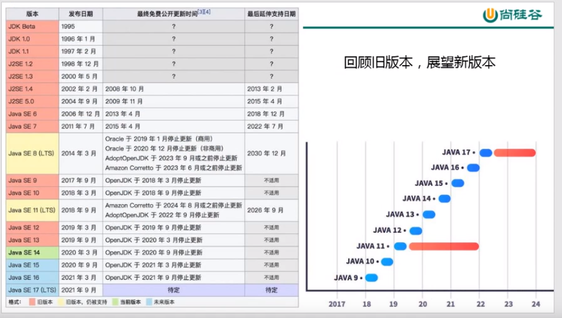
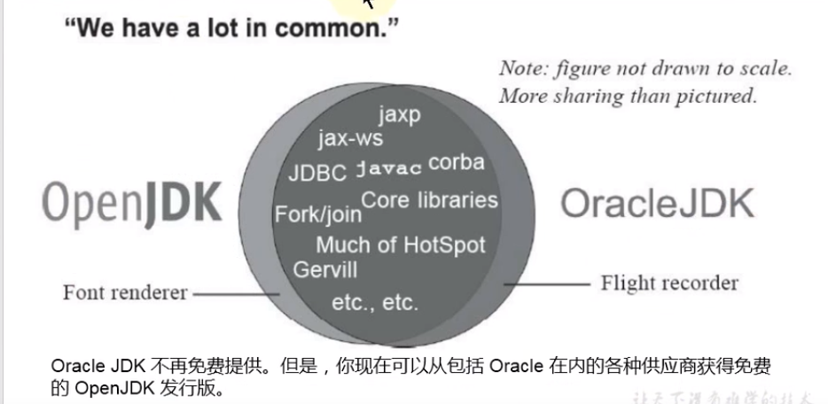
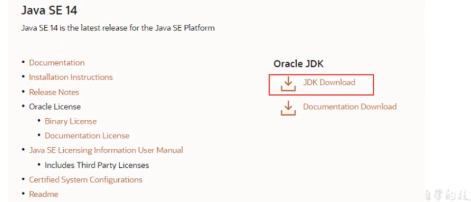
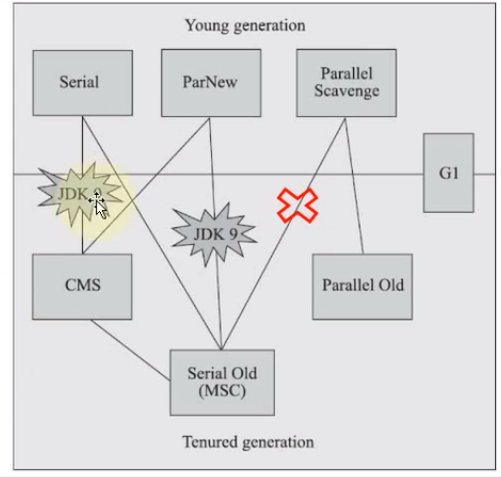
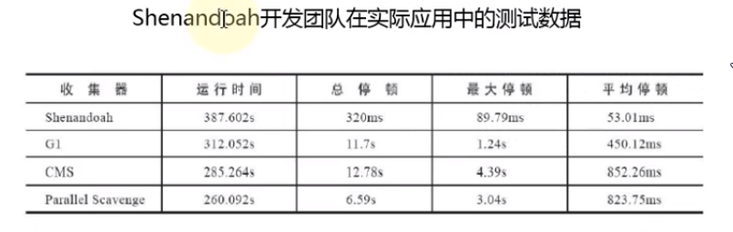
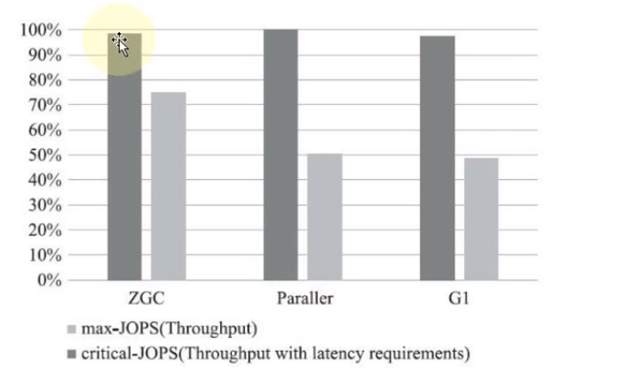
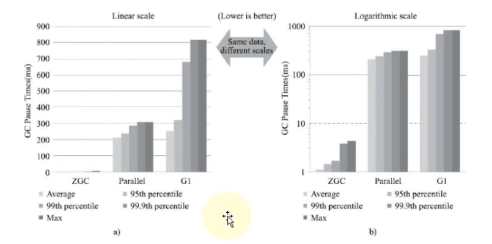
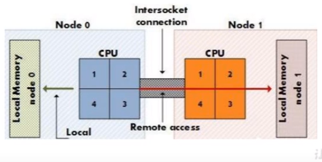

# 说在前面

从哪几个角度去学习新特性

* 语法层面（如：lambda，switch，自动装箱拆箱）
* API层面（如：Stream、Optional、String）
* 底层优化（如：JVM优化，GC，GC参数，js引擎）

# Java14新特性概述

此版本包含的JEP（JDK Enhancement Proposals，JDK增强提案）比Java12和13加起来的还要多。总共16个新特性，包括两个孵化器模块、三个预览特性、两个弃用的功能以及两个删除的功能。

* 孵化器模块：将尚未定稿的API和工具先交给开发者使用，以获得反馈，并用这些反馈进一步改进Java平台的质量。
* 预览特性：是规格已经成型，实现已经确定，但还未最终定稿的功能。它们出现在Java中的目的是收集在真实世界中使用的反馈信息，促进这些功能的最终定稿。这些特性可能会随时改变，根据反馈结果，这些特性甚至可能会被移除，但通常所有预览特性最后都会在Java中固定下来。

 

Oracle JDK和Open JDK



# 环境的安装说明

JDK14的下载和安装：[Oracle](https://www.oracle.com/java/technologies/javase-downloads.html)



IDEA2020.1的下载、安装和配置：[Jetbrains](https://www.jetbrains.com/idea/nextversion/#section=windows)


# instanceof的模式匹配

这个特性很有意思，因为它为更为通用的模式匹配打开了大门。模式匹配通过更为简洁的语法基于一定的条件来抽取对象的组件，而instanceof刚好是这种情况，它先检查对象类型，然后再调用对象的方法或访问对象的字段。

有了该功能，可以减少Java程序中显式强制转换的数量，从而提高生产力，还能实现更精确、更简洁的类型安全的代码。

示例代码：[PatternMatchTest.java](../src/test/java/com/windea/study/java14/PatternMatchTest.java)

注意：
* 在模式匹配条件语句中，可以直接对模式匹配变量进行操作，无需再对原始变量进行强制类型转换。
* 模式匹配变量的作用域是模式匹配条件语句内部。
* null值不会通过模式匹配。

# 非常实用的NullPointerException

该特性改进了NullPointerException的可读性，能更准确地给出null变量的信息。

该特性可以帮助开发者提高生产力，以及改进各种开发工具和调试工具的质量，目标是减少开发人员的 困惑和担忧。

相信很多Java程序员都一样对null和NPE深恶痛绝，因为它确实会带来各种各样的问题，如：
* 它是错误之源，NullPointerException是目前Java程序开发中最经典的异常，它会使你的代码膨胀。
* 它让你的代码充斥着深度嵌套的null检查，代码的可读性糟糕透顶。
* 它自身是毫无意义的。null自身没有任何的语义，尤其是它代表着在静态类型语言中以一种错误的方式对确实变量值的建模。
* **它破坏了Java哲学。Java一直试图避免让程序员意识到指针的存在，唯一的例外是null指针。**
* 它在Java的类型系统上开了个口子。null并不属于任何类型，这意味着她可以被赋值给任意引用类型的变量。这会导致问题，原因是当这个变量被传递到系统中的另一个部分后，你将无法获知这个null变量最初赋值到底是什么类型。

其他语言如何解决NPE问题：
* 在Groovy中使用安全导航操作符可以访问可能为null的变量。
  `def a = foo?.bar`
* 在Haskell和Scala中也有类似的替代品，如Haskell的`MayBe`类型，Scala中`Option[A]`，这是一个类型为A的可选值的容器。
* 在Kotlin中，其类型系统严格区分一个引用可以容纳null还是不能容纳。也就是说，一个变量是否可空必须显式声明。对于可空变量，在访问其成员时必须进行为空判断，否则编译无法通过。

Java做了哪些努力：
* Optional
  * Optional在可能为null的对象上做了一层封装，强制你思考不存在的情况，这样就能避免潜在的空指针异常。
  * 在日常开发中，经常结合Stream一同使用Optional。
* JEP 358：Helpful NullPointerExceptions
  * 该特性可以 更好地提示哪个敌方出现的空指针异常，需要通过`-XX:+ShowCodeDetailsInExceptionMessages`开启。
  * 在未来的版本中，这个特性可能会默认启用。
  * 这个增强特性不仅适用于方法调用，只要会导致NPE的地方也都适用，包括字段的访问、数组的访问和赋值。
  * 弊端：暴漏代码的内部结构，可能存在安全问题。

# record结构的基本使用

神说要用record，于是就有了

* 我们有时候需要编写许多低价值的重复代码来实现一个简单的数据载体类：构造函数，访问器，equals()，hashCode()，toString()等。为了避免这种代码，Java14推出record。
* **Java14也许最让人兴奋，同时也是最令人惊讶的创新就是：record类型的引入。**
* 使用record来减少类声明语法，效果类似Lombok的@Data注解，Kotlin中的数据类。它们的共同点就是类的部分或全部状态可以直接在类头中描述，并且这个类只是包含了纯数据而已。
* 该预览特性提供了一种更为紧凑的语法来声明类。值得一提的是，该特性可以大幅减少定义类似数据类型时所需的样板代码。

示例代码：[RecordTest.java](../src/test/java/com/windea/study/java14/RecordTest.java)

# record使用的注意点

注意：
* record对应的类拥有final修饰符，且继承自`java.lang.Record`抽象类。
* record的字段都拥有`final`修饰符。
* record可以自动生成主构造器（基于record的参数列表）
* record可以自动生成属性（为`person`参数生成`person()`属性）
* record可以自动生成`equals()`方法。（基于自动生成的属性）
* record可以自动生成`hashCode()`方法。（基于自动生成的属性）
* record可以自动生成`toString()`方法。（基于自动生成的属性，形如`Person[name=Windea]`、`Person[]`）
* record可以没有任何参数。
* 可以在record中定义静态字段、静态方法、构造器和实例方法。
* 不能在record中定义实例字段，不能声明显式的父类。

和枚举类型一样，record也是类的一种受限形式。作为回报，record在简洁性方面提供了显著的好处。

为了在Java14中引入这种新类型，需要在`java.lang.Class`对象中添加以下两个方法：
* `RecordComponent[]`
* `getRecordComponents()`
* `boolean isRecord()`

# switch表达式的使用

* 这是JDK12和JDK13中的预览特性，现在是正式特性了。
* 该特性规定，switch可以当做语句使用，也可以当做表达式使用。
* 该特性可以简化日常的编码方式，也为本版本中预览的模式匹配特性打下了基础。

示例代码：[TextBlockTest.java](../src/test/java/com/windea/study/java14/TextBlockTest.java)

# 文本块的使用

增加了两个转义序列：分别是`\`（不换行）与`\s`（空格）。

目标：
* 简化多行的字符串，避免对换行等特殊字符进行转义，简化编写Java程序。
* 增强Java程序中用字符串表示的其他语言的代码的可读性。
* 解析新的转义序列。

注意：
* 文本块会去除每行文本最小的缩进。
* 文本块会添加最后一行空行。

示例代码：[SwitchTest.java](../src/test/java/com/windea/study/java14/SwitchTest.java)

# 弃用ParallelScavenge和SerialOld GC组合



* 由于维护和兼容性测试的成本，在JDK8时将Serial+CMS、ParNew+SerialOld这两个组合声明为废弃（JEP 173），并在JDK9时完全取消了这些组合的支持（JEP 214）。
* ParallelScavenge和SerialOld GC的组合现在被标记为Deprecate了。
* JDK官方给出将这个理由是：这个GC组合需要大量的代码维护工作，并且已经很少被使用。因为它的使用场景应该是一个很大的Young区配合一个很小的Old区，这样的话，Old区用SerialOldGC去收集时停顿时间我们才能勉强接受。
* 废弃了parallel young generation GC与SerialOld GC的组合。现在使用`-XX:+UseParallelGC -XX:UseParallelOldGC`或者`-XX:-UseParallelOldGC`都会出现警告。

# 删除CMS垃圾回收器

* 自从G1（基于Region分代）横空出世后，CMS在JDK9中就被标记为Deprecate了。
* CMS的弊端：
  * 会产生内存碎片，导致并发清除后，用户线程可用的空间不足。
  * 既然强调了并发，CMS收集器对CPU资源非常敏感。
  * CMS收集器无法处理浮动垃圾。
* 上述这些问题，尤其是碎片化问题，给你的JVM就像是埋了一颗炸弹。说不定哪次就在你的业务高峰期来一次FGC。当CMS停止工作室，会把SerialOld GC作为备选方案，而SerialOld GC是JVM中性能最差的垃圾回收方式，停顿个几秒钟，上十秒钟都有可能。
* 移除了CMS垃圾回收器，如果在JDK14中使用`-XX:UseConcMarkSweepGC`的话，会出现警告。
* 现在G1回收器已经成为默认回收器好几年了。
* 我们还看到了引入了两个新的收集器：ZGC（JDK11）和Shenandoah（open jdk12），主打特点：低停顿时间



# 来自未来的ZGC的使用介绍

令人震惊、革命性的ZGC

* ZGC与Shenandoah目标高度相似，在尽可能对吞吐量影响不大的前提下，实现在任意堆内存大小下都可以把垃圾收集的停顿时间限制在10毫秒以内的低延迟。
* 《深入理解Java虚拟机》一书中这样定义ZGC：ZGC收集器是一块基于Region内存布局的，（暂时）不设分代的，使用了读屏障、染色指针和内存多重映射等技术来实现可并发的标记-压缩算法的，以低延迟为首要目标的一款垃圾收集器。

测试数据：





虽然ZGC还在试验状态，没有完成所有特性，但此时性能已经相当亮眼，用“令人震惊革命性”来形容不为过。

未来将会是服务端、大内存、低延迟应用的首选垃圾收集器。

* JDK14之前，ZGC仅Linux才支持。
* 尽管许多使用ZGC的用户都使用类Linux的环境，但在Windows和macOS上，人们也要ZGC进行开发部署和测试。许多桌面应用也可以从ZGC中受益。因此，ZGC特性被抑制刀了Windows和macOS上。
* 现在macOS或Windows上也能使用ZGC了，参数：`-XX:+UnlockExperimentalOptions -XX:+UseZGC`

# 其他新特性和结束语

## JEP 343：打包工具（孵化器模块）

* 这个孵化器工具为开发者带来了一种打包Java应用的方式，目的在于创建一个简单的打包工具，可以用于构建exe、pkg、dmg、deb、rpm格式的安装文件。
* JDK14引入了`jdk.incubator.jpackage.jmod`，它基于Java FX javapackager tool构建。

## JEP 345：G1的NUMA-Aware的内存分配

该功能改进了G1垃圾回收器在非一致内存访问（NUMA）系统上的整体性能。

NUMA就是非同一内存访问架构（non-uniform memory access），是一种为多处理器的电脑设计的内存架构，内存访问时间取决于内存相对于处理器的位置。



## JEP 349：JFR事件流

Java为了更方便地了解允许的JVM情况，在之前的JDK11版本中引入了JFR特性，即JDK Fight Recorder，但是使用不太灵活，虽然JVM通过JFR暴露了超过500项数据，但是其中大部分数据只能通过解析JFR日志文件才能获取到，而不是实时获取。用户想要使用JFR的数据的话，必须先开启JFR进行记录，然后停止记录，再将飞行记录的数据dump到磁盘上，然后分析这个记录文件。

举例：
```
jcmd <PID> JFR start name=test duration=50s settings=template.jfc
filename=output.jfr
```

新特性中，可以公开JFR的数据，用于持续监视，从而简化各种工具和应用程序对JFR数据的访问。 

## JEP 352：非易失性映射字节缓冲区

对FileChannel API进行了扩展，以允许创建MappedByteBuffer实例。

与易失性存储器（RAM）不同，它们在非易失性数据存储（NVM）上工作，但是，目标平台是Linux x64.

非易失性内存能够持久保存数据，因此可以利用该特性来改进性能。

## 其他

* JEP 370：外部内存访问API
* JEP 362：弃用Solaris和SPARC的移植
* JEP 367：删除Pack200工具和API