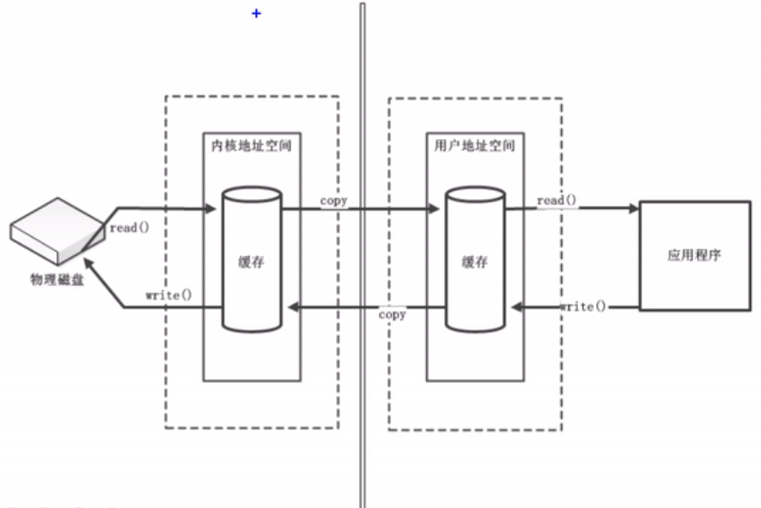
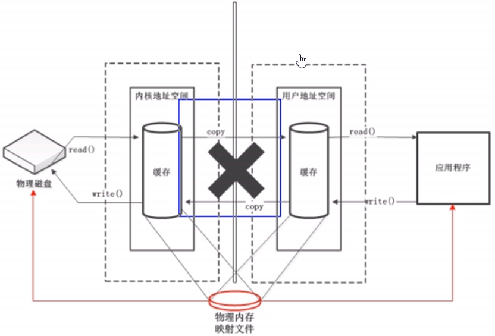
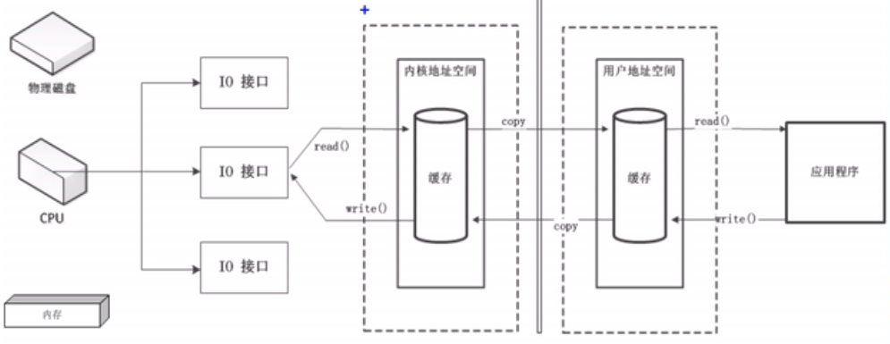
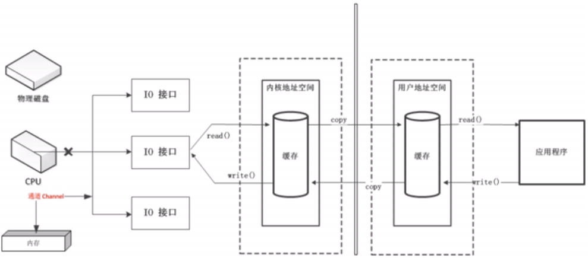
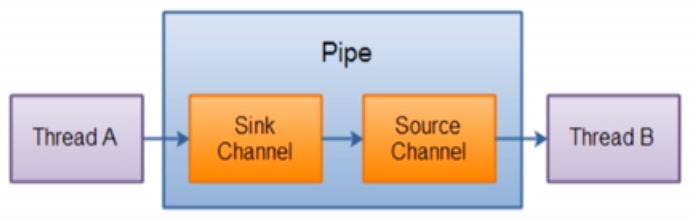

# Java NIO

## Java NIO简介

Java NIO（New IO/Non Blocking IO）是从Java1.4版本开始引入的一个新的IO API，可以替代标准的Java IO API，NIO与原来的IO有同样的作用和目的，但是使用的方式完全不同，NIO支持面向缓冲区的、基于通道的IO操作。NIO将以更加高效的方式进行文件的读写操作。

## Java NIO与IO的主要区别

| IO                       | NIO                          |
|:-------------------------|:-----------------------------|
| 面向流（Stream Oriented） | 面向缓冲区（Buffer Oriented） |
| 阻塞IO（Blocking IO）    | 非阻塞IO（Non Blocking IO）  |
| 无                       | 选择器（Selectors）          |

* IO基于流，是单向的。
* NIO基于通道，通道负责连接，需要缓冲区传输数据，是双向的。

## 缓冲区（Buffer）和通道（Channel）

Java NIO系统的核心在于：通道（Channel）和缓冲区（Buffer）。通道表示打开到Io设备（例如文件、套接字）的连接。若需要使用NIO系统，需要用于连接IO设备的通道以及用于容纳数据的缓冲区，然后操作缓冲区，对数据进行处理。

简而言之，通道负责传输，缓冲区负责存储。

## 缓冲区

一个用于特定基本数据类型的容器，由java.nio包定义，底层是数组。所有的缓冲区都是Buffer抽象类的子类。

Java根据数据类型的不同（boolean除外），提供了对应类型的缓冲区的实现。

Java NIO中的Buffer主要用于与NIO通道进行交互，数据是从通道读入缓冲区，从缓冲区写入通道中的。

相关方法：

* `allocate()` 静态方法，用于获取缓冲区。
* `put()` 存入数据到缓冲区中。
* `get()` 获取缓冲区中的数据。
* `flip()` 切换到读模式。位置改为0，界限改为之前的位置，并取消标记。
* `rewind()` 准备重新读取数据。位置改为0，并取消标记。
* `clear()` 清空数据。里面的数据仍然存在，但是处于被遗忘的状态。
* `mark()` 标记一个位置。
* `reset()` 恢复到被标记的位置。
* `hasRemaining()` 判断缓冲区中是否还有剩余的数据。
* `remaining()` 获取缓冲区中剩余的数据的长度。

缓冲区中的四个核心属性：

* `capacity` 容量，表示缓冲区中最大存储数据的容量。（一旦声明不能改变）
* `limit` 界限，表示缓冲区中可以操作的数据的大小。（后面的数据是不能进行读写的）
* `position` 位置，缓冲区中正在操作数据的位置。
* `mark` 标记，用于记录当前的位置。

规则：`0 <= mark <= position <= limit <= capacity`

## 直接缓冲区与非直接缓冲区

* 非直接缓冲区：通过`allocate()`方法分配的缓冲区，将缓冲区建立在JVM的内存中。
* 直接缓冲区：通过`allocateDirect()`方法分配的缓冲区，将缓冲区建立在物理内存中。可以提高效率，但是不安全、不稳定、消耗大。

说明：

* 字节缓冲区要么是直接的，要么是非直接的。如果为直接字节缓冲区，则Java虚拟机会尽最大努力在此缓冲区上执行本机IO操作。也就是说，在每次调用基础操作系统的本机IO操作之前（或之后），虚拟机都会尽量避免将缓冲区的内容复制到中间缓冲区中（或从中间缓冲区复制内容）。
* 直接缓冲区可以通过调用此类的allocateDirect工厂方法来创建。此方法返回的缓冲区进行分配和取消分配所需成本通常高于非直接缓冲区。直接缓冲区的内容可以驻留在常规的垃圾回收堆之外，因此，它们对应用程序的内存需求量造成的影响可能并不明显。所以，建议将直接缓冲区主要分配给那些易受基础操作系统的本机IO操作影响的大型的、持久的缓冲区。一般情况下，最好仅在直接缓冲区能在程序性能方面带来明显好处时分配它们。
* 直接缓冲区还可以通过FileChannel的map方法将文件区域直接映射到内存中来创建。该方法返回MappedByteBuffer。Java平台的实现有助于通过JNI从本机代码创建直接字节缓冲区。如果以上这些缓冲区中的某个缓冲区实例指的是不可访问的内存区域，则试图访问该区域不会更改该缓冲区的内容，并且将会在访问期间或稍后的某个时间导致抛出不确定的异常。
* 字节缓冲区是否是直接缓冲区可以通过调用isDirect方法来确定。提供此方法就是为了能够在性能关键型代码中执行显式缓冲区管理。

非直接缓冲区：

直接缓冲区：

## 通道（Channel）

由java.nio.channels包定义。通道表示IO源于目标打开的连接。通道类似于传统的“流”，但是通道本身不能直接访问数据只能与缓冲区进行交互。

传统方式：

通道：

通道的主要实现类：
* `FileChannel` 用于操作本地文件。
* `SocketChannel` 用于tcp连接（客户端）。
* `ServerSocketChannel` 用于tcp连接（服务端）。
* `DatagramChannel` 用于udp连接。

通道的获取方式：
* 支持通道的类型的`getChannel()`方法。
  * `FileInputStream`/`FileOutputStream`
  * `RandomAccessFile`
  * `Socket`
  * `ServerSocket`
  * `DatagramSocket`
* NIO2中针对各个通道提供了`open()`静态方法。
* NIO2中的Files工具类的`newByteChannel()`静态方法。

## 文件通道（FileChannel）

使用通道完成文件的复制（非直接缓冲区）：[ChannelTest.java: Lines 30-53](../src/test/java/com/windea/study/nio/ChannelTest.java#L30-L53)

使用通道完成文件的复制（直接缓冲区，内存映射文件）：[ChannelTest.java: Lines 55-72](../src/test/java/com/windea/study/nio/ChannelTest.java#L55-L72)

通道之间的直接数据传输：[ChannelTest.java: Lines 74-83](../src/test/java/com/windea/study/nio/ChannelTest.java#L74-L83)

* `transformTo()`
* `transformFrom()`

## 分散读取与聚集写入

分散读取（Scattering Reads）：将通道的数据分散到多个缓冲区中。注意是按顺序执行。

聚集写入（Gathering Writes）：将多个缓冲区中的数据聚集写入到通道注意是按顺序执行。

[ChannelTest.java: Lines 85-111](../src/test/java/com/windea/study/nio/ChannelTest.java#L85-L111)

## 字符集（Charset）

* 编码：字符集 →字节数组
* 解码：字节数组 →字符串

相关方法：
* `Charset.forName(str)` 静态方法，获取对应的字符集
* `Charset.newEncoder()` 获取对应的编码器
* `Charset.newDecoder()` 获取对应的解码器。

## NIO的非阻塞式网络通信

### 阻塞与非阻塞

传统的IO流都是阻塞式的。也就是说，当一个线程调用读写方法时，该线程被阻塞，直到有一些数据被读取或写入，该线程在此期间不能执行其他任务，因此，在完成网络通信进行IO操作时，由于线程会阻塞，所以服务器必须为每个客户端都提供一个独立的线程进行处理。当服务器端需要处理大量客户端时，性能急剧下降。

Java NIO是非阻塞模式的，当线程从某通道进行数据读写时，若没有数据可用时，该线程可以进行其他任务。线程通常将非阻塞IO的空闲时间用于在其他通道上执行IO操作，所以单独的线程可以管理多个输入和输出通道。因此，NIO可以让服务端使用一个或有限的几个线程来同时处理连接到服务端的所有客户端。

### 概述

使用NIO完成网络通信的三个核心：
* 通道（Channel）：负责连接
* 缓冲区（Buffer）：负责数据的存取
* 选择器（Selector）：可选择通道的多路复用器，用于监控可选择通道的IO状况。

通道的继承结构
* Channel
  * SelectableChannel
  * SocketChannel
  * ServerSocketChannel
  * DatagramChannel
  * Pipe.SinkChannel
  * Pipe.SourceChannel
  
注意：FileChannel不能切换成非阻塞模式。

### 阻塞式IO

[BlockingNIOTest1.java](../src/test/java/com/windea/study/nio/BlockingNIOTest1.java)

[BlockingNIOTest2.java](../src/test/java/com/windea/study/nio/BlockingNIOTest2.java)

### 非阻塞式IO

TCP通道：[NonBlockingNIOTest1.java](../src/test/java/com/windea/study/nio/NonBlockingNIOTest1.java)

UDP通道：[NonBlockingNIOTest2.java](../src/test/java/com/windea/study/nio/NonBlockingNIOTest2.java)

## 选择器（Selector）

### SelectionKey

当调用`register(selector, ops)`为通道注册选择器时，选择器对通道的监听事件，需要通过第二个参数ops指定。

可以监听的事件类型包括：
* `SelectionKey.OP_READ = 1` 读
* `SelectionKey.OP_WRITE = 4` 写
* `SelectionKey.OP_CONNECT = 8` 连接
* `SelectionKey.OP_ACCEPT = 16` 接收

若注册时不止监听一个事件，可以使用位或操作符连接。

## 管道（Pipe）

Java NIO管道是两个线程之间的单向线程连接，Pipe有一个source通道和一个sink通道。数据会被写到sink通道，从source通道读取。

## Java NIO2（Path、Paths与Files）
