# 字符串的前生今世

## 如何出生

字符串的6种创建方式

* 使用`char数组配合new来创建
* 使用byte数组配合new来创建
* 使用int数组配合new来创建
* 使用已有字符串配合new来创建
* 使用字面量创建
* 使用+运算符拼接创建字符串

## char数组创建

> 注意：从Java9开始，String的内部结构由`char[]`变成了`byte[]`。

最基本的创建方式，因为字符串就是将字符串接起来。

```
String s = new String(new char[]{'a', 'b', 'c'});
```

它的内部结构如下（Java8）：

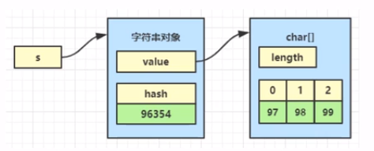

其中，97其实就是'a'，98其实就是'b'，99骑士就是'c'。（根据Unicode编码表）

## byte数组创建

> 注意：从Java9开始，String的内部结构由`char[]`变成了`byte[]`。

从网络传递过来的数据，或是通过IO读取到的数据，都有从byte数组转化为字符串的需求。

```
String s = new String(new byte[]{97,98,99});
```

上述的`new byte[]{97, 98, 99}`就可以是：

* 从网络（例如一个浏览器的http请求）传递过来的字节数据。
* 从IO（例如一个文本文件）读取到的数据。

它的内部结构其实与由char数组创建的情况是一样的，`byte[]`会在构造时被转化为`char[]`。


一个byte占1个字节，一个char可能占1~3个字节（UTF-8），也可能占2个字节（UTF-16）。

Java中的char字符都是以unicode编码的。

## int数组创建

有时候我们还需要用两个char表示一个字符，比如 emoji表情😂，它用unicode编码表示为0x1F602，存储范围已经超过了char能表示的最大值0xFFFF，因此需要使用int[]来构造这样的字符串，如下：

```
String s = new String(new int[]{0x1F602},0,1);
```

转换过程如图所示：

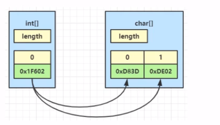

## 从已有字符串创建

这种创建方式最为简单，但是需要注意两个字符串对象引用同一个`char[]`对象。

```
String s1 = new String(new char[]{'a', 'b', 'c'});
String s2 = new String(s1);
```

内存结构如下：

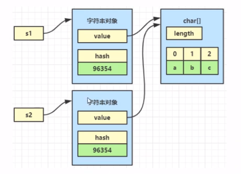

## 字面量创建

这种创建方式最为我们熟悉。

```
public static void main(String[] args){
	String s = "abc";
} 
```

`“abc”`被称为字符串字面量（String literal），拥有非对象、懒加载、不重复三点特性。

### 非对象

严格来说，字面量在代码运行到它所在语句之前，它还不是字符串对象。要理解从字面量编程字符串对象的过程，需要从字节码的角度来分析。在上面的java代码被编译为class文件后，`“abc”`存储于“类文件常量池”中。

```
Constant pool: //常量池
	#1 = Methodref #19.#41   //java/lang/object."<init>"()
	#2 = String #42          //abc
	...
```

当class完成类加载后，`“abc”`这个字面量被存储于“运行时常量池”（归属于方法区/元空间）中，其中#1 #2都会被翻译为运行时真正的内存地址。

再看一下class中main方法的字节码

```
public static void main(java.lang.String[]); //
	descriptor: ([Ljava/lang/String;)V
	flags: ACC_PUBLIC, ACC_STATIC
	Code:
	  stack=1, locals=2, args_size=1
		0: 1dc #2
		2: astore_1
		3: return
		...
```

将来main方法被调用时，就会执行里面的字节码指令：

```
0: 1dc #2      //创建字符串常量到运行时常量池中
2: astore_1    //将字符串常量赋值给局部变量
3: return      //从方法中返回
```

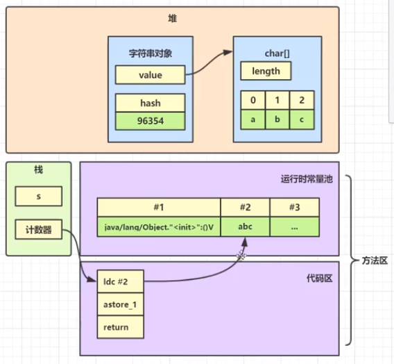

### 懒加载

当第一次用到`“abc"`字面量时，才会创建对应的字符串变量。

可以在IDEA的debug界面中的memory工具来查看字符串对象的数量（以String为关键字查询）

### 不重复

同一个类中的值相同的字符串字面量，其实只有一份。

不同的类常量池是不一样的。“类文件变量池”包括“运行时常量池”都是以类为单位的。

这时候虽然“字面量”是两份，但是“字符串对象”仅有一个。

## 拼接创建

可以通过+运算符量两个字符串（其中一个也可以是其他类型）拼接为一个新字符串。

```
//例1
String s = "a" + "b";
//例2
final String x1 = "b";
String s1 = "a" + x1;
//例3
String x2 = "b";
String s2 = "a" + x2;
//例4
String s3 = "a" + 1;
```

其中例1和例2的原理是一样的，例3和例4的原理是一样的。

* 例1：并没有真正的拼接操作发生，从源码编译为字节码时，javac就已经把`“a”`和`"b"`串在一起了。这是一种编译期的优化处理
* 例2：x1是常量，其值不可改变（并且字符串的内容本身也不可变），同上。
* 例3：x2是变量，不能在编译期间确定值，最后字符串的+操作符会被转化为`StringBuilder`或`StringBuffer`的`append`方法。
* 例4：同上。

对于字符串的+操作符的说明

```
String x = "b";
String s = "a" + x; 

//等同于下面这句（在编译时会被替换）
//StringBuilder和StringBuffer的toString方法的实现，就是利用它们的value字段生成新的字符串
String s1 = new StringBuilder().append("a").append(x).toString();
```

## JDK9之后的改变

> 注意：从Java9开始，使用invokedynamic指令扩展了字符串的拼接的实现方式

从JDK9开始，String的内部存储方式以及拼接方式发生了较大的改变。

* 不再使用`char[]`粗糙你字符，改为了`byte[]`，目的是节约内存。
* 使用invokedynamic指令扩展了字符串的拼接的实现方式。

### 内存结构改变

例如，字符串中仅有拉丁字符时：

```
String s = new String (new byte[]{97, 98, 99});
```

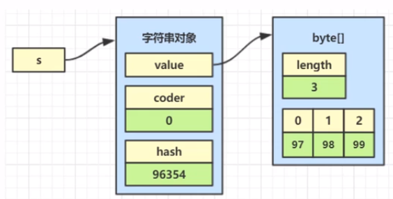

例如，字符串中有中文字符

```
String s = new String(new byte[]{0xd5, (byte)0xc5},Charset.forName("gbk"));
```

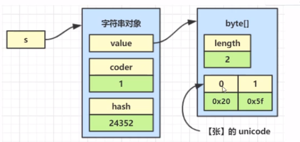

例如，字符串中既有中文字符也有拉丁字符：（这时会把所有字符视为unicode处理）

```
String s = new String(new byte[]{0xd5, (byte)0xc5, 97},Charset.forName("gbk"));
```

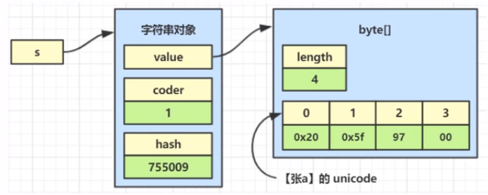

其中coder属性用于区分字符串的编码。0表示（仅有）拉丁字符，1表示（包含）unicode字符。

### 拼接方式的改变

例如：

```
public static void main(String[] args){
	String x = "b";
	String s = "a" + x;
}
```

常量池

```
Constant pool:
	#1 = Methodref #5.#22   //java/lang/object."<init>"()
	#2 = String #23         //b
	...
```

主方法

```
public static void main(java.lang.String[]); //
	descriptor: ([Ljava/lang/String;)V
	flags: ACC_PUBLIC, ACC_STATIC
	Code:
	  stack=1, locals=2, args_size=1
		0: 1dc #2
		2: astore_1
		3: aload_1
		4: invokedynamic #3, 0
	[Ljava/lang/String;]Ljava/lang/String;
		9: astore_2
		10: return
		...
```

 对于字符串的+操作符的说明

```
String x = "b";
String s = "a" + x;

//等同于下面这句（在编译时会被替换）
//编译器会提供lookup，用来查找MethodHandle
MethodHandles.Lookup lookup = MethodHandles.lookup();
CallSite callSite = StringConcatFactory.makeConcatWithConstants(
    lookup,
    //方法名，会自动生成
    "arbitrary",
    //方法的签名，参数分别为返回值类型和参数类型
    MethodType.methodType(String.class,String.class),
    //具体处方格式，其中、1表示变量的占位符，用来被x替代
    "a\1"
);
//用来反射执行拼接方法
String s = (String) callSite.getTarget().invoke(x);
```

 主要是为了对字符串的拼接做各种扩展优化，多了扩展途径。其中最为重要的是MethodHandle，它使用了策略模式生成，JDK提供的所有策略可以在StringconcatFactory.Stratege中找到。

| 策略名                | 内部调用                                     | 解释                                      |
| --------------------- | -------------------------------------------- | ----------------------------------------- |
| BC_SB                 | 字符串拼接生成StringBuilder代码              | 等价于`new StringBuilder()`               |
| BC_SB_SIZED           | 字符串拼接生成StringBuilder代码              | 等价于`new StringBuilder(n)`，n为预估大小 |
| BC_SB_SIZED_EXACT     | 字符串拼接生成StringBuilder代码              | 等价于`new StringBuilder(n)`，n为准确大小 |
| MH_SB_SIZED           | MethodHandle生成StringBuilder代码            | 等价于`new StringBuilder(n)`，n为预估大小 |
| MH_SB_SIZED_EXACT     | MethodHandle生成StringBuilder代码            | 等价于`new StringBuilder(n)`，n为准确大小 |
| MH_INLINE_SIZED_EXACT | MethodHandle内部使用字节数组直接构造出String | 默认策略                                  |

如果想改变策略，可以在运行时添加JVM参数，例如将策略改为BC_SB。

```
-Djava.lang.invoke.stringConcat=BC_SB
-Djava.lang.invoke.stringConcat.debug=true
-Djava.lang.invoke.stringConcat.dumpClasses=匿名类导出路径
```

还有一种选择，是在javac编译时仍使用1.5的方法拼接字符串，而不是采用invokedynamic，那就是在javac运行时加上参数：

```
-XDstringConcat=inline
```

默认策略为MH_INLINE_SIZED_EXACT，使用字节数组直接构造出String

例如有下面的字符串拼接代码

```
String x = "b"
String s = "a" + x + "c" + "d";
```

使用这个策略后，内部会执行如下等价调用：

```
String x = "b";
//预先分配字符串需要的字节数组
byte[] buf = new byte[4];
//创建新字符串，这时内部字节数组值为[0, 0, 0, 0]
String s = StringConcatHelper.newString(buf, 0);
//执行拼接操作，字符串内部字节数组值变为[97, 0, 0 ,0]
StringConcatHelper.prepend(1,buf,"a");
//执行拼接操作，字符串内部字节数组值变为[97, 98, 0, 0]
StringConcatHelper.prepend(2, buf, x);
//执行拼接操作，字符串内部字节数组值为[97, 98, 99, 100]
//到此拼接完毕
```

### 注意

* StringConcatHelper对外是不可见的，因此无法直接测试，只能反射测试。
* prepend方法可以直接修改字符串中byte数组属性的内容。这是允许的，因为是同一个byte数组。

## 模仿BC_SB策略

### 方法手动生成

[StringConcatDemo.java](../src/main/java/com/windea/study/stringtable/StringConcatDemo1.java)

### 字节码生成方法

[StringConcatDemo2.java](../src/main/java/com/windea/study/stringtable/StringConcatDemo2.java)

JDK9可以适配生成不同的参数个数、类型的MethodHandle，原理就是这样。

# 字符串之家——StringTable

## 家养与野生

其实字符串也一样，分为家养的和野生的。

除了字面量方式创建的字符串是家养的，其他方法创建的字符串都是野生的。

* 字面量方式创建的字符串会放入StringTable中，StringTable管理的字符串才具有不重复的特性，这种就像是家养的。
* 其他方式创建的字符串本质上都是通过new来创建，它们都是在堆中创建新的字符串对象，不会考虑字符串重不重复，这种就像是野生的。野生字符串的缺点就是如果存在大量值相同的字符串，对内存的占用就会非常严重。

如何保证家养的字符串对象不重复：JDK使用了StingTable来解决，StringTable是采用c++代码编写的，数据结构上就是一个hash表，字符串对象充当了hash表中的key，ke的不重复性是hash表的基本特征。

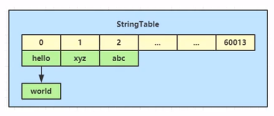

当代码运行到一个字面量`"abc"`时，会首先检查StringTable中有没有相同的key，如果没有，则创建新字符串对象加入，否则直接返回已有的字符串对象。

## 收留野生字符串

野生的字符串也有机会得到收留。字符串提供了intern方法来实现去重，让字符串对象有机会受到StringTable的管理。这个方法会尝试将调用者放入StringTable。

```
public native String intern();
```

* 如果StringTable中已有，则总会返回StringTable中的字符串对象。
* （JDK1.6）如果StringTable中没有，则会将当前字符串对象的复制放入StringTable，然后返回复制。
* （JDK1.7以上）如果StringTable中没有，则会将当前字符串对象放入StringTable，然后返回本身。

## 家的好处

使用`String.intern()`方法以节约JVM内存。

## 家的位置

StringTable的位置（1.6）

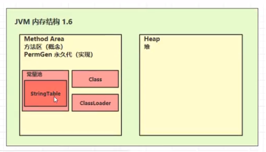

StringTable的位置（1.8）

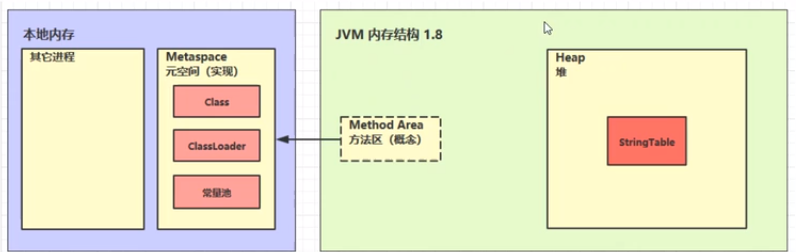

Java8将StringTable从方法区一道堆内存的中的几点原因

* 永久区的垃圾回收需要Full GC。
* 堆内存的垃圾回收需要Minor GC，回收时间较少，回收速度更快。

如何证明：

* 1.6中不断将字符串用intern加入StringTable，最后撑爆的是永久区内存，为了让错误快速出现，将内存设置的小一些：`-XX:MaxPermSize=10m`，最终会出现`java.lang.OutOfMemoryError: PermGen space`。
* 1.8中不断将字符串用intern加入StringTable，最后撑爆的是堆内存，为了让错误快速出现，将堆内存设置的小一些：`-Xxx10m -XX:-UseGCOverheadLimit`，最后一个虚拟器参数是避免GC频繁引起其他错误，而不是我们期望的`java.lang.OutOfMemoryError: Java heap space`。

[InternDemo.java](../src/main/java/com/windea/study/stringtable/InternDemo.java)

## intern出重原理

j参见dk的源码：<http://hg.openjdk.java.net/jdk8u/jdk8u/hotspot/file/5bd0e0bcb152/src/share/vm/classfile/symbolTable.cpp>

（具体代码略）

## G1去重

可以使用以下的jvm参数开启G1垃圾回收器，并开启字符串去重功能。
```
-XX:+UseG1GC
-XX:+UseStringDeduplication
```

原理是让多个字符串对象引用同一个char数组来达到节省内存的目的。

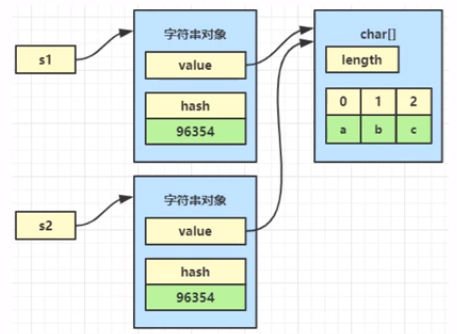

特点
* 由G1垃圾回收器在minor gcj阶段自动分析优化，不需要程序员自己干预。
* 只有针对那些多次回收还不死的字符串对象，才会进行去重优化，可以通过jvm参数`-XX:StringDeduplicationAgeThreshold=n`来调整。
* 可以通过jvm参数`-XX:+PringStringDeduplicationStatictics`查看G1去重的统计信息。
* 与调用intern去重相比，G1去重的好处在于自动，但缺点是即使char数组不重复，字符串本身还要占用一定的内存（对象头、value引用、hash），intern去重是字符串只存一份，更省内存。

## 家的大小

StringTable足够大，才能发挥性能优势，大意味着String在hash表中冲突减少，链表短，性能高。

* 可以通过jvm参数`-XX:+PrintStringTableStatistics`来查看StringTable的大小，JDK8中的默认大小是60013.
* 要注意StringTable底层的hash表在JVM启动后就固定不变了。
* 这个哈希表可以在链表长度太长时进行rehash，但不是利用扩容来实现的，而是通过重新计算字符串的hash值来让它们分布均匀。
* 如果想在启动前调整StringTable的大小，可以通过jvm参数`-XX:StringTableSize=n`来指定。

## 字符串之死

字符串也是一个对象，只要是对象，终究逃不过死亡的命运。字符串对象与其他Java毒系一样，只要失去了利用价值，就会被垃圾回收，无论是野生字符串，还是家养字符串。

可以通过jvm参数`-XX:+PrintStringTableStatistics -XX:+PrintGCDetails -verbose:gc`证明家养的字符串也能被垃圾回收。

# 面试题讲解

## 1. 判断输出

```
String str1 = "string";
String str2 = new String("string");
String str3 = str2.intern();

System.out.println(str1 == str2); //#1
System.out.println(str1 == str3); //#2
```

解答：
* 1：false，因为后者是实例化出来的新对象。
* 2：true，因为两者是StringTable中的同一对象。

## 2. 判断输出

```
String baseStr = "baseStr";
final String baseFinalStr = "baseStr";

String str1 = "baseStr01";
String str2 = "baseStr" + "01";
String str3 = baseStr + "01";
String str4 = baseFinalStr + "01";
String str5 = new String("baseStr01").intern();

System.out.println(str1 == str2); //#1
System.out.println(str1 == str3); //#2
System.out.println(str1 == str4); //#3
System.out.println(str1 == str5); //#4
```

解答：
* 1：true，因为字符串拼接在编译时已被处理。
* 2：false，因为字符串拼接后得到了实例化的新对象。
* 3：true，因为字符串拼接在编译时已被处理。
* 4：true，因为两者是StringTable中的同一对象。

## 3. 判断输出（注意版本）

```
String str2 = new String("str") + new String("01");
str2.intern();
String str1 = "str01";
System.out.println(str2 == str1); //#1
```

解答：
* 1：（JDK6）false，因为前者并未被放入StringTable中。
* 1：（JDK7以上）true，因为两者是StringTable中的同一对象。

## 4. 判断输出

```
String str1 = "str01";
String str2 = new String("str") + new String("01");
str2.intern();
System.out.println(str2 == str1); //#1
```

解答：
* 1：false，因为前者并未被放入StringTable中，StringTable中已有相同的对象。

## 5. `String s = new String("xyz")`创建了几个字符串对象？

解答：
* 两个，一个在StringTable中，一个不在StringTable中。

## 6. 判断输出

```
String s1 = "abc";
String s2 = "abc";
System.out.println(s1 == s2); //#1
```

解答：
* 1：true，因为两者是StringTable中的同一对象。

## 7. 判断输出

```
String s1 = new String("abc");
String s2 = new String("abc");
System.out.println(s1 == s2); //#1
```

解答：
* 1：false，因为两者都是实例化出来的新对象，不可能相等。

## 8. 判断输出

```
String s1 = "abc";
String s2 = "a";
String s3 = "bc";
String s4 = s2 + s4;
System.out.println(s1 == s4); //#1 
```

解答：
* 1：false，因为后者本质上是通过StringBuilder拼接出来的新字符串。

## 9. 判断输出

```
String s1 = "abc";
final String s2 = "a";
final String s3 = "bc";
String s4 = s2 + s4;
System.out.println(s1 == s4); //#1 
```

解答：
* 1：true，因为后者在编译时已处理字符串的拼接，两者是StringTable中的同一对象。

## 10. 判断输出

```
String s = new String("abc");
String s1 = "abc";
String s2 = new String("abc");
System.out.println(s == s1.intern()); //#1
System.out.println(s == s2.intern()); //#2
System.out.println(s1 == s2.intern()); //#3
```

解答：
* 1：false，因为前者是实例化出来的新对象，后者是StringTable中的对象。
* 2：false：因为前者是实例化出来的新对象，后者是StringTable中的对象。
* 3：true：两者是StringTable中的同一对象。
